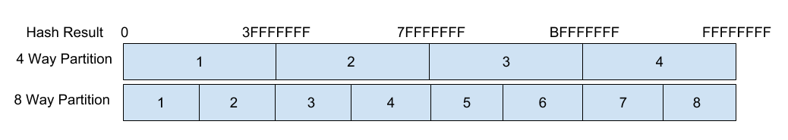
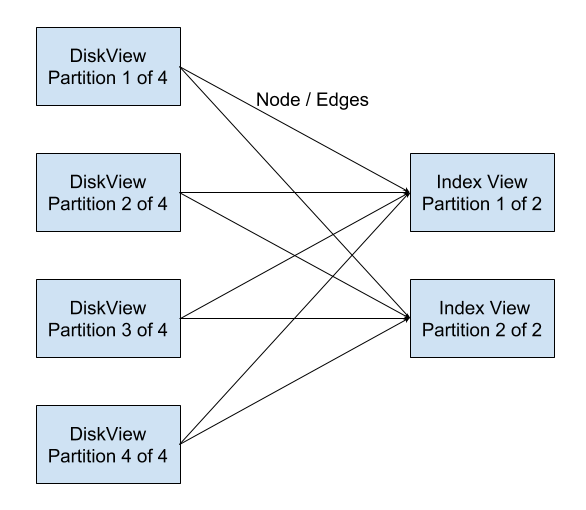
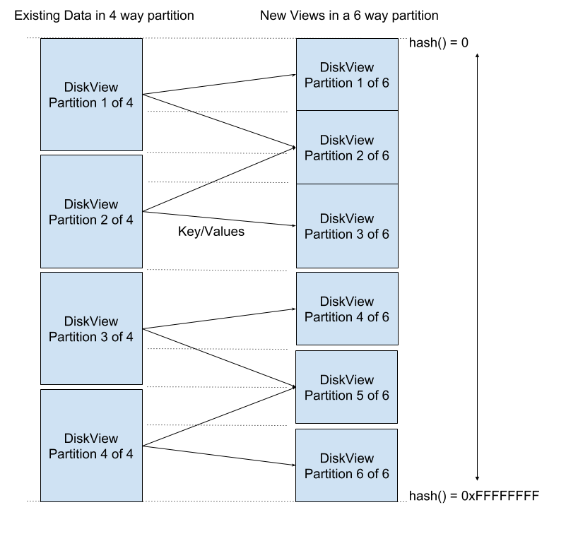
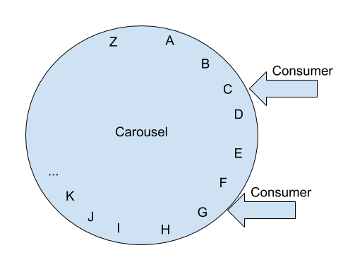
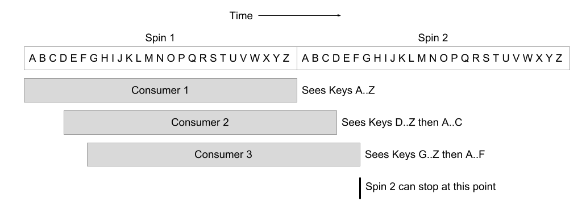
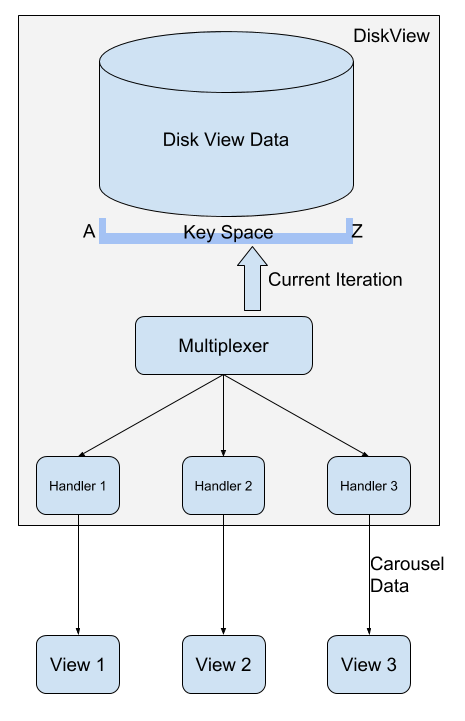
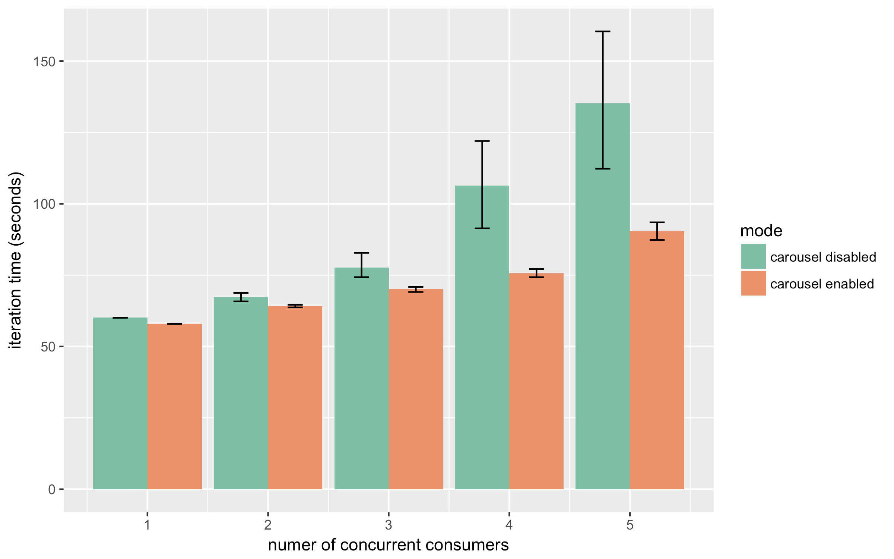
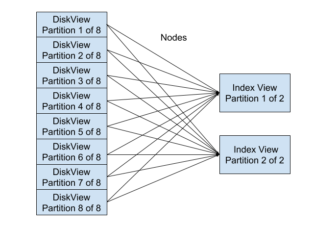

Booting Beam Views
==================

*Written in March 2018 to describe an alternative approach to initializing
views. Some sections were redacted and edited before making this public.*

Introduction
------------

We expect a Beam cluster to consist of potentially many types of views.
One of the goals of Beam is that these views are simple to write. We
originally suggested that this could be achieved by having the shared
log manage data persistence, and views could initialize themselves by
applying the entire log at startup. This leads to an ever growing log &
ever growing view boot times.

We considered an approach where we deleted individual log entries to
make the log smaller, but this causes a few problems. Trying to
implement a deletion policy directly on the log is complicated, as a log
entry may contain many keys which might have differing deletion
requirements. The log file itself would need to be re-written to new
files to actually reclaim disk space. What if instead of trying to
manage all this within the log, we just use the log for recent & in
flight operations and move longer term management of the data elsewhere?

We created Disk Views in ProtoBeam v2 to hold larger data sets than we
could fit in memory. The Disk Views persist all of their data to the
local disk/SSD, and they leverage the OS buffer cache to keep hot data
in RAM. This seemed like a good fit for our expected use cases.
The Disk Views currently keep every version of every data item.

Now that the Disk Views had a copy of all the history, there was no need
to keep this data in the log forever. When other views start up, they
can read most of the information from the Disk Views, then read the most
recent history from the log. Beam can scale out the number of Disk Views
for more capacity and higher read throughput, so the Disk Views are a
better place for this data than the log. Once the DiskView instances
have enough replicas of each data item, up through a given log index,
the entries in the log up to that index can be safely deleted.

We think this approach will allow other Beam views to keep their data in
memory, if they so choose, and this will help keep other views simple. A
view that could consume data at 800MiB/sec (not unreasonable with a 10Gb
network) could initialize itself with 1TiB of data in ~20 minutes.

Background: Partitioning
========================

Disk Views process log entries and write their data to an embedded
key/value store. The data model entities will need to be mapped to keys.
With the exception of small test clusters, we expect that data set sizes will
require Disk Views to be partitioned, i.e. each Disk View instance
contains some subset of the overall data.

Hash Partitions
---------------

It is expected that a dataset stored in Beam will not fit on a single
host and will need to be partitioned across multiple hosts. Beam does
not require that all views use the same partitioning scheme, or that
they use the same number of partitions. In Protobeam v2 we used a hash
partitioning scheme, where a node ID is hashed and the resulting 32 bit number
broken up into a number of ranges to assign it to a partition. Using
ranges allows the Disk View to understand how differing partition counts
relate to each other, for example it knows that the first partition in
an 8 way partition is entirely contained within the first partition of a
4 way partition.



With data split across partitioned Disk Views, a consumer that needs to
consume the entire data set would need to perform an iteration from a
set of Disk Views at once (just like it would have consumed the entire
log before Disk Views existed).



Iteration Service
=================

Disk Views offer an API that exposes their persisted data. Other views
use the Iteration API to read the dataset when they start up. The
following sections describe design concerns for this API / approach.

Data Order
----------

Views normally process data from the log, so they expect to see data in
log index order. However, a Disk View is unlikely to store data in log
index order, because it's not an efficient structure for serving reads.
We considered four different ordering guarantees that DiskViews could
provide and discuss each one in the next subsections.

### No Order

The easiest for the Disk View is to offer no guarantees about ordering.
The Disk View could serve the data in whatever order is most convenient
for it, most likely the natural underlying order of its embedded K/V
store. How much work this is to consume will vary greatly by the
consuming view. Some will require little to no additional work. Others,
like the Index View, will have to use different data structures to be
able to insert older values/log indexes after processing newer ones.

### Log Order

The easiest for views to consume would be log order, as this is the
order they already expect when reading from the log. Disk Views are
unlikely to have data in this order, and would likely need to keep a
second copy of the data in log order in order to be able to expose it
efficiently in that order. None of the embedded key-value stores we
tested for the DiskView support iterating over data in write order
(which would alleviate the need for the 2nd copy).

### Key Order

The Disk View could easily expose data in key order, but this creates
complexity for the consumer. For Key Order (and also Log Order),
consumers that need to consume from multiple Disk Views would need to
carefully aggregate these multiple streams, similar to the merge part of
a mergesort. This would also prevent the Carousel optimization described
below.

### Log Order Within Keys

One other possibility is to ensure that data is in log order per key,
but keys are not required to be in order. For a Disk View that stores
data in (Key, Index) order, this is the natural order that the keys are
in. For consumers, they are likely to be tracking the index on a per-key
basis, so having entries come in increasing log index order for each key
allows them to process it in a very similar way to processing it from
the log. This relaxation in key ordering also allows a consumer to
arbitrarily combine streams from multiple Disk Views without regard to
ordering of items from different Disk Views.

For ProtoBeam v2 we implemented iterations with the *log order within
keys* ordering and found that, even for complex consumers such as the
index view, this was as easy to consume as the log.

Data Filtering
--------------

The consumer may only need some subset of the data the DiskView
contains. For example, an Index View might only need nodes and have no
use for edges. It's inefficient (increases network traffic &
contention) to ship all this data from the Disk Views to the consumers
if they don't need it. The Disk View can offer filtering options to
reduce this network traffic. This can help improve overall performance.

One of the filters could be to apply a partitioning scheme. Views using
the same partitioning scheme as the Disk View (or another scheme where
it's possible to compute if partitions overlap) can both reduce the
number of Disk Views a consumer needs to fetch data from, as well as
reduce network traffic.

For example if there was a cluster setup with a 4 way partition, and we
wanted a new set of views in a 6 way partition, the new views can
understand how their partitions are contained within the existing
partitions and request data only from the relevant source views. In
addition those old views can apply the 6 way partition filter so they
only send the relevant data to each of the new views. This is shown in
the following diagram:



Where partitioning schemes don't overlap, the consumer will need to
request iterations of all the partitions (e.g. an index view that is
partitioned by the value rather than the key):

The Disk View should also apply log index range filtering, so that the
data it returns to the consumer is consistent to a specific log index.
Once the consumer finishes iterating it can start reading the log from
the next index.

In addition to filtering, it may also be beneficial for the Disk View to
offer transformation services, again so that network traffic may be
reduced, or to help do work once at the source rather that repeating it
at many consumers. For example the Index View could use this to have the
Disk View only send the one field it cares about from the value. As all
instances of the index view for that field want to see that value, this
could be extracted once at the Disk View instead of in each consumer.

View Selection
--------------

With the ordering guarantees covered in the ordering section, the
iteration consumer is pretty simple. The most complex part is how it
selects views. Given something that describes what Disk View servers are
available and what data partitions they have (e.g. the cluster
metadata), and a consumers' iteration request (i.e. the filtering,
partitioning & transformation options), the consumer must calculate
which are the best set of Disk Views to use. Some things it should take
into consideration are:

1)  If there is partitioning in the consumer's request, select only
    from Disk Views that contain the relevant partitions.

2)  Given the improved throughput from requesting from multiple Disk
    Views concurrently, it should prefer using more Disk Views with
    smaller partitions, as opposed to fewer Disk Views with larger
    partitions.

3)  But, given a selected Disk View, it should aim to use as much of
    that Disk View's data as possible, to make best possible use of
    the I/O spent by the Disk View.

4)  It may want to exclude Disk Views that are significantly lagging
    others.

5)  We may want to segregate instances of Disk Views by usage pattern,
    i.e send iteration requests to replica 1 of each partition, and
    send other query requests to replicas 2 & 3.

An Iteration Service with too many consumers or a consumer that requests
from too many servers will hit contention on its network connection.
It'll be important to keep this in mind when sizing hosts & cluster
sizes, and view types/counts.

Carousels
---------

During a deployment or other cluster management operation, multiple
views may end up re-initializing at the same time, all trying to fetch
the same data from the Disk Views. When multiple consumers are doing
this at overlapping times, it can lead to I/O contention and cache
thrashing. This leads to poor performance of the iterations as well as
other work being performed by the disk view (such as answering query
requests, and writing new entries it tailed from the log). For example
running 5 concurrent iterations of a ~20M item dataset can cause each
iteration to take more than double the time of a single iteration on its
own. (See [Appendix A](#appendix-a-io-contention-testing))

To solve the thrashing problem, we wanted to multiplex access to the
disk. One iteration through the underlying disk should serve the data to
many consumers. We developed an abstraction for this which we call
Carousels, shown in the following diagram:



Imagine a rotating carousel that contains the Disk Views' dataset spread
around the edge. Each consumer is at one point at the edge of the
carousel. As the carousel spins, the consumer watches the data go by.
Each consumer needs to see all of the data; it completes once the
carousel has spun a full revolution. A single spin of the carousel can
serve many consumers at once.

In the event that new consumers appear after the iteration has started,
another iteration will be needed to allow those new consumers to see a
complete dataset. For example if the Disk View has keys A..Z and a
single consumer starts a carousel, it'll see key & values in order A..Z.
If another consumer requires a carousel while the first is still in
progress, it'll see the remaining keys from the current point onwards,
and then start another iteration to see a full dataset, so it might see
keys D..Z and then A..C, as shown in in the following diagram:



Note that this satisfies the ordering guarantees (*log order within
keys*) provided by the Iteration service. However, the carousel would
not be able to provide the *key order* guarantee, since consumers 2 and
3 above receive keys out of order.

With the addition of the carousel, there are three major components to
the Iteration Service, as shown in the diagram below:

-   The **consumer view** selects which Disk Views to make carousel
    requests to and specifies its requirements (filtering,
    transformation etc)

-   The DiskView's carousel **request handler** receives this request
    from the consumer and registers itself with the multiplexer. As it
    receives data from the multiplexer, it will process the data and
    send the relevant data back to the consumer.

-   The DiskView's **multiplexer** will run the actual iteration
    against the disk and forward data to the handlers. It will start
    an iteration when the first handler registers, and will stop the
    iteration once all consumers have seen all the data. The
    multiplexer must be careful to maintain the *Log Order Within
    Keys* guarantee; it can do this by ensuring that the handler is
    started at a key boundary.



### Slow Consumers

One potential issue in the carousel approach is that a single slow
consumer would cause other concurrent consumers to be limited to the
slow consumers' rate. If this were a problem, the multiplexer could spot
this and move the consumer off the carousel and onto a dedicated
iterator. As the consumer is slow, this wouldn't cause much disk
contention.

ProtoBeam v2 Implementation 
===========================

In ProtoBeam v2 the Disk View implements both an iteration server and
consumer. Other views, including the Memory View and Index View, support
being initialized from Disk View iterations.

The Disk View server, written in Go, implements most of the features
described above, including:

-   Filtering / Transformation options
    -   Partition filtering
    -   Exclude node or edges filtering
    -   Exclude values (just return keys)
    -   Index range filtering
-   The Log Order Within Keys ordering guarantee
-   The Carousel

In order to support adding new Disk View instances to an existing
cluster or to handle cases where a Disk View has been offline for a long
period of time, the Disk View needs to implement initializing itself
from an Iteration Service just like any other View does.

We also implemented a Rust version of the Disk View for comparison. This
version additionally ejected what it considered to be slow consumers,
causing them to restart. However, this caused problems when the carousel
was used to count nodes and edges locally (with no network traffic),
while it was used to initialize a remote index view (with lots of
network traffic). The index view would be unnecessarily ejected as it
was much slower than the counter.

The iteration consumer implementation included:

-   View Selection
    -   Prefer smaller rather than larger partitions
    -   But otherwise try and use all of the selected partition
    -   Requests concurrent iterations where multiple Disk Views are selected
    -   Option to ignore specific servers

Evaluation
----------

We tested various iteration request patterns on a cluster with a
graph of ~10M nodes & ~10M edges. The requests were made with a test
consumer written in Go that summarizes the data received.

We start with a baseline of time taken to iterate the RocksDB data from
Go using a standalone tool: this results in an iteration time of 46
seconds (384MiB/sec).

Performing an iteration of the same dataset using a DiskView with an
iteration filter that results in no data being sent to the client
(removing any grpc/protobuf overhead) takes 50 seconds. The extra time
is a result of key parsing/filtering and other iteration bookkeeping.

We then move on to comparing iteration time with multiple concurrent
consumers, both with carousel enabled, and carousel disabled. All
consumers receive all the data.



You can see that with the carousel disabled iteration time increases
with concurrency, and at 5 concurrent consumers iteration time is now
over 2x the single consumer iteration time. With the carousel enabled
iteration time does increase, but increases more slowly, and the
resulting spread of iterations times is much more consistent.

Looking at CPU profiling on the Disk Views, [Protocol
Buffers](https://en.wikipedia.org/wiki/Protocol_Buffers)
marshalling comes to dominate as the number of consumers increase. There
are approaches we believe can help alleviate that impact but they were
not explored at this time (e.g. pre-serialization, switch to
[FlatBuffers](https://en.wikipedia.org/wiki/FlatBuffers)).

As described in the view selection section, reading concurrently from
multiple smaller partitions can allow the consumer to see the data at a
higher overall rate. Here we have a consumer that requests the same 10M
node/10M edge graph, but instead of from a single Disk View, it requests
it from 8 Disk Views, each of which contains 1/8th of the graph. The
consumer completes this iteration in 20.7 seconds, giving a data rate of
839MiB/sec, a considerable improvement vs the single Disk View source
iteration.



Conclusion
==========

The Iteration Service helps Beam meet its goal that views are easy to
write. It's practical for a view to rely on the Disk Views & log for
state management. Consuming data from the Iteration Service is typically
no more work than consuming it from the log. The bulk of the complexity
of the iteration is contained within the server implementation, which
only needs writing once. As dataset sizes increase then some
consideration to partition size & network bandwidth needs to be taken
into account (but this is true for most distributed systems).

Appendix A: I/O Contention Testing
==================================

We ran 5 concurrent iterations of a Disk View's dataset without using
carousels to observe the contention problem mentioned in the
introduction. A Disk view contained a dataset of 9.6M nodes
& 9.3M edges and has rocksDB compression disabled. It was iterated from
another host using the `cc`
tool we wrote (cc stands for "carousel client", but the servers were
instructed to disable the shared carousel and run a normal iterator
instead).

```
dist/cc -s <view> -dedicated ride 0 1

Took 1m0.119672114s
Average 289.59 MiB/s
```

This is the baseline performance of a single iteration.

We then ran increasing number of concurrent overlapping iteration
requests, which each consumer running on a separate VM, here's the
results for 5 concurrent iterations.

```
$ dist/cc -s <view> -noedges -nonodes -dedicated ride 0 1

Took 1m52.360824068s
Average 154.95 MiB/s

Took 1m54.519488931s
Average 152.03 MiB/s

Took 2m28.973828933s
Average 116.87 MiB/s

Took 2m40.46249817s
Average 108.50 MiB/s

Took 2m20.179012451s
Average 124.20 MiB/s
```

You can see that with 5 concurrent iterations the iteration time is
significant larger than the single iteration baseline, and also varies
considerably, on average these iterations were over 2x the baseline.

Appendix B: Concurrent Carousel Testing
=======================================

The Disk View was configured the same as Appendix A, and iteration
requests made from the same set of consumer VMs, requesting the entire
dataset. This time the iterations had the carousel feature enabled.

The single consumer baseline is as expected basically the same as when
carousels were disabled.

```
$ dist/cc -s <view> ride 0 1

Took 57.948935365s
Average 300.44 MiB/s
```

As before, increasing number of concurrent overlapping iteration
requests were made from different VMs, resulting in these runs for 5
concurrent consumers.

```
$ dist/cc -s <view> ride 0 1

Took 1m27.365368079s
Average 199.28 MiB/s

Took 1m31.402092429s
Average 190.48 MiB/s

Took 1m33.521864895s
Average 186.16 MiB/s

Took 1m31.704571878s
Average 189.85 MiB/s

Took 1m28.88971672s
Average 195.86 MiB/s
```
