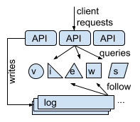

Building Feature-Rich Data Stores Using a Central Log
=====================================================

*This document was written in January 2019 as an extended abstract for an
internal conference. Some sections were redacted and edited before making this
public.*

Consistent and fault-tolerant data stores are commonly built using one of two
approaches:

1.  The "RSM" approach uses one replicated state machine \[1, 2\] or one
    primary-backup group. The entire dataset is replicated to every machine.
    Examples include ZooKeeper \[3\], PostgreSQL \[4\], and Neo4j \[5\], and
    Stardog \[6\]. This approach is simple to implement and can optimize for
    read queries using local data structures. Such systems are often
    feature-rich. They can scale in read throughput by having replicas serve
    requests, but their write throughput and capacity is fundamentally limited.

2.  The "stamped-out" approach is to apply the RSM approach many times. Each RSM
    serves as an independent unit, hosting one partition or shard. Examples
    include Kafka \[8\], RAMCloud \[9\], and CockroachDB \[10\]. Such systems
    scale in read throughput, write throughput, and capacity. However, any
    operation involving multiple partitions is complicated by communication and
    coordination, and query performance depends greatly on the partitioning
    scheme used.

At the end of 2017, we set out to build a graph store with more capacity than
the RSM approach could offer. However, we weren't ready to accept the complexity
of the stamped-out approach or to limit the cross-partition features in our
store -- graphs are notoriously difficult to partition. We hoped to find some
middle ground.

The key problem was finding a suitable architecture to implement a data store
with the following properties:

  - Fault-tolerant (no single point of failure),
  - Consistent (not eventually-consistent),
  - Scalable capacity and query rates (10 to 100x that of a single node),
  - Modest write rates (10K-100K writes per second), and
  - Supporting hard-to-partition queries (such as SQL, graphs).

We explored this problem through our *Akutan* prototypes. We first built an
in-memory key-value store from scratch \[11\], then iterated to a disk-based
property graph \[12\], then to a knowledge graph \[13\].

We based our implementations around a *central log*. The central log isn't a
novel idea \[14, 15\], but it's often overlooked. The central log was the key to
enabling us to iterate quickly in a small team. We describe our experience and
compare with the stamped-out approach, which we've had experience implementing
in the past \[9\]. We argue that others should use a central log to build data
stores with similar requirements.

The central log architecture \[11\] is shown in the figure. All write requests
are sequenced into an append-only *central log*. The log is a network service
that is internally replicated for fault-tolerance and persisted for durability.
Several *view servers* read the log and apply its entries in sequence, each
deterministically updating its local state. Different view servers maintain
different state. An *API tier* accepts requests from clients. It appends the
write requests to the log, and it collects data from the view servers to answer
reads.

The central log introduces one constraint and one complication. The constraint
is that it imposes a fundamental bottleneck: the maximum rate of appends to the
log determines the maximum rate of change to the entire dataset \[11\]. Most log
implementations can achieve at least tens of thousands of appends per second.
The complication is that older entries of the log must be truncated eventually,
to prevent the log from growing without bound. Some view servers must retain and
serve copies of that information \[17\].

In exchange, we've found many features to be drastically easier to implement
using a central log than with the stamped-out approach (we implemented all of
these in Akutan):

  - **Transactions** with a stamped-out approach require complex distributed
    protocols \[18, 19\]. Using a central log, there's no need for coordination
    outside the log \[11, 14, 20, 21\].

  - **Consistent cross-partition queries** and **historical global snapshots**
    were easy to implement with a central log, because a log index identifies a
    global version of the dataset. In the stamped-out approach, these require
    either distributed transactions \[18\], relaxing consistency \[22\], or
    atomic clocks \[23\].

  - **Replication**, **data migration**, and **cluster membership** were easier
    to implement using a central log, because no server strongly "owns" data in
    that model. View servers receive all updates through the log. They only need
    to replicate snapshots to each other during boot (to enable log compaction)
    \[17\]. In contrast, stamped-out systems must coordinate ownership handoffs
    and membership changes using complex protocols \[9\].

  - **Partitioning** and **indexing** the dataset multiple ways were both easier
    to implement using a central log by adding view servers. In a stamped-out
    system, doing so requires updating the scope of every transaction.

We believe the central log is well-suited to meeting the requirements stated
above. Using a cluster of small VMs (40 GB disk, 8 GB RAM, 4 VCPUs), our Akutan
implementation stored 4 billion items totalling 1.2 TB of data. Using Kafka, the
data was loaded at an average write rate of 25 MB/sec \[12\].

We urge others to consider our experience when building future data stores. The
central log is a great approach for systems that need more capacity than an RSM
can provide but don't need infinitely-scalable write throughput. Not only is it
simpler than the stamped-out approach, it's better suited for implementing
features like transactions and special-purpose indexes. These low-level features
enable expressive data models and query languages, with easy to understand
consistency properties, for clients.

# References

1.  Schneider, F B. Implementing fault-tolerant services using the state machine
    approach: a tutorial. *ACM Computing Surveys* 22, 4 (Dec. 1990).

2.  Ongaro, D; Ousterhout, J. In Search of an Understandable Consensus
    Algorithm. *USENIX Annual Technical Conference* (2014).
    [PDF](https://ongardie.net/var/blurbs/pubs/raft-atc14.pdf)

3.  Hunt, P; Konar, M; Junqueira, F P; Reed, B. ZooKeeper: wait-free
    coordination for internet-scale systems. *USENIX Annual Technical
    Conference* (2010).

4.  PostgreSQL Global Development Group, The. PostgreSQL 11.1 Documentation:
    High Availability, Load Balancing, and Replication.
    <https://www.postgresql.org/docs/11/high-availability.html>

5.  Neo4j, Inc. The Neo4j Operations Manual v3.5: Introduction to New4j Causal
    Clustering.
    <https://neo4j.com/docs/operations-manual/current/clustering/introduction/>

6.  Stardog Union. Stardog 6: The Manual: High Availability Cluster.
    <https://www.stardog.com/docs/#_high_availability_cluster>

7.  \[redacted\]

8.  Apache Software Foundation. Kafka 2.1 Documentation: Design: Replication.
    <https://kafka.apache.org/documentation/#replication>

9.  Ousterhout, J; Gopalan, A; Gupta, A; Kejriwal, A; Lee, C; Montazeri, B;
    Ongaro, D; Park, S J; Qin, H; Rosenblum, M; Rumble, S M; Stutsman, R; Yang,
    S. The RAMCloud Storage System. *ACM Transactions on Computer Systems*
    (Sept. 2015).
    [PDF](https://ongardie.net/var/blurbs/pubs/ramcloud-tocs15.pdf)

10. Cockroach Labs. CockroachDB Documentation: Concepts: Architecture Overview.
    <https://www.cockroachlabs.com/docs/stable/architecture/overview.html>

11. [ProtoAkutan v1](protoakutan_v1.md) (Nov. 2017).

12. [ProtoAkutan v2](protoakutan_v2.md) (Mar. 2018).

13. [ProtoAkutan v3](protoakutan_v3.md) (Aug. 2018).

14. Balakrishnan, M; Malkhi, D; Wobber, T; et al. Tango: Distributed Data
    Structures over a Shared Log. *Symposium on Operating Systems Principles*
    (2013).
    [PDF](https://www.microsoft.com/en-us/research/wp-content/uploads/2013/11/Tango.pdf)

15. Kreps, J. The Log: What every software engineer should know about real-time
    data's unifying abstraction. *LinkedIn Engineering Blog* (2013).
    <https://engineering.linkedin.com/distributed-systems/log-what-every-software-engineer-should-know-about-real-time-datas-unifying>

16. \[redacted\]

17. [Booting Akutan Views](booting_views.md) (Mar. 2018).

18. Lee, C; Park, S J; Kejriwal, A; Matsushita, S; Ousterhout, J.
    Implementing linearizability at large scale and low latency.
    *Symposium on Operating Systems Principles* (2015).
    [ACM Open Access](https://dl.acm.org/citation.cfm?id=2815416)

19. Tracy, M. How CockroachDB Does Distributed, Atomic Transactions.
    *Cockroach Labs Blog* (Sep. 2015).
    <https://www.cockroachlabs.com/blog/how-cockroachdb-distributes-atomic-transactions/>

20. Thomson, A; Diamond, T; Weng, S-C; Ren, K; Shao, P; Abadi, D J.
    Calvin: Fast Distributed Transactions for Partitioned Database
    Systems. *ACM SIGMOD International Conference on Management of
    Data* (2012).
    [PDF](http://cs.yale.edu/homes/thomson/publications/calvin-sigmod12.pdf)

21. Freels, M. Consistency without Clocks: The FaunaDB Distributed
    Transaction Protocol. *Fauna Blog* (Oct. 2018).
    <https://fauna.com/blog/consistency-without-clocks-faunadb-transaction-protocol>

22. Du, J; Elnikety, S; Zwaenepoel, W. 2013. Clock-SI: Snapshot
    Isolation for Partitioned Data Stores Using Loosely Synchronized
    Clocks. *IEEE Symposium on Reliable Distributed Systems* (2013).
    [PDF](https://infoscience.epfl.ch/record/187553/files/srds2013_clocksi.pdf)

23. Corbett, J C; Dean, J; Epstein, M; et al. Spanner: Google’s
    Globally-Distributed Database. *USENIX Symposium on Operating
    Systems Design and Implementation* (2012).
    [PDF](https://www.usenix.org/system/files/conference/osdi12/osdi12-final-16.pdf)
