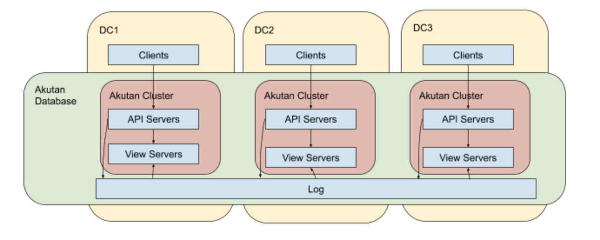

# Akutan Control Plane Requirements

*This document was written in August-September 2018 to describe the key
scenarios in operating a production Akutan cluster, as well as how those should be
handled. The document aims to be agnostic of how this is implemented. Some
sections were redacted and edited before making this public.*

## A global Akutan database

This is what we expect a global Akutan database to look like:



For the purpose of this document, we define a *Akutan Database* as a (potentially)
global deployment, consisting of a (potentially) global log and one or more
*Akutan Clusters*. Each *Akutan Cluster* resides in a single datacenter and contains
multiple redundant copies of the entire database state. Note that the log is
defined as being outside the Akutan clusters, for the purpose of this document.

The log is a single, (potentially) global, distributed, replicated, persistent
queue. The log determines the ordering for all changes to the database state,
thereby removing the need for other components in Akutan to coordinate. The
consistency of the entire database rests on that of the log, so the log will
fundamentally require a distributed consensus protocol at some level. The log is
not the final resting place for the data, and the log is not expected to scale
in terms of capacity: the old entries at the start of the log will be truncated
periodically.

The API servers within a Akutan cluster serve clients. They have two roles:

1.  They submit changes to the database state as new entries are appended to the
    log.

2.  They collect data from various view servers to answer database queries. This
    part is fairly sophisticated, as described in the
    [ProtoAkutan v3 doc](protoakutan_v3.md).

The view servers within a Akutan cluster each maintain a subset of the database
state in some data structure. They update their state deterministically based
solely on the contents of the log, and they respond to various lookup requests
from the API servers. The view servers may store their local state on disk or in
volatile memory. We expect the types of views to grow over time.

One important and special type of view is called the Disk View. In aggregate,
the Disk View instances store the entire dataset on disk (with several copies),
except perhaps the latest entries that have been recently written to the log.
Other views and new Disk Views may be initialized from the existing Disk View
instances, plus the recent entries in the log.

## Spaces, replication, and partitioning

Each Akutan cluster has multiple types of views and many instances of each. The
views logically provide lookups in multiple *spaces*: multiple hash-spaces or
key-spaces. An instance of a view hosts a single range of a single space.

For example, ProtoAkutan v3's Disk Views operate in two modes, forming two
different hash-spaces: the HashSP-space and the HashPO-space. The basic unit of
data in v3 is a id-subject-predicate-object fact. The HashSP space is defined as
the 64-bit output of a hash of the fact's subject concatenated with its
predicate. The HashPO space is defined as a similar hash but with the predicate
and the object. Each DiskView instance is booted as either a HashSP instance
with a start and an end hash, or as a HashPO instance with a start and an end
hash.

It is important to note that Akutan views are not replicated in the traditional
sense. Once they're booted, each instance applies changes to its state from the
central log. View instances only communicate with each other in the special case
of a new instance initializing its state from the Disk Views.

Each space will require management over time. For example, as the dataset grows,
a single view instance will need a smaller hash- or key-range of the space.
Key-spaces will also need to be adjusted based on the shape of the data: some
ranges of a key-space might grow while other ranges might shrink.

As shorthand, we might talk about a hash-space partitioned 4 ways and replicated
3 ways. This implies 12 distinct view instances:

  - Three serving hashes `0x00..` to `0x40..`,
  - Three serving hashes `0x40..` to `0x80..`,
  - Three serving hashes `0x80..` to `0xc0..`, and
  - Three serving hashes `0xc0..` to `0xff..`.

Creating logical partitions with logical replica groups would be a simple and
reasonable way to manage a cluster.

Akutan can also operate in the case of uncleanly partitioned spaces. This is
especially useful during cluster transitions. An example of this, with a
diagram, is given in the RPC Fanout section of the
[ProtoAkutan v3 doc](protoakutan_v3.md).

A Akutan cluster is defined as *fully available* (for writes and non-stale reads)
if the following conditions are met:

1.  Each of its spaces is fully covered: every *point* (a key or hash)
    in every space is served by at least one available and up-to-date
    view instances (with respect to their position in the log).

2.  The log is available for appends and non-stale reads.

3.  At least one API server is available.

A Akutan cluster is defined as *healthy* if the following conditions are met:

1.  Each of its spaces is fully covered three times: every *point* (a key or
    hash) in every space is served by at least three available and up-to-date
    view instances (with respect to their position in the log).

2.  The log is available for non-stale reads and appends.

3.  At least three API servers are available.

## Log management

The log presents two unique challenges when it comes to Akutan's control
plane:

1.  In a global Akutan database, the log is really the only global component. It
    needs to replicate its state across datacenters, while the other Akutan
    components will not communicate across datacenters.

2.  The consistency of the entire database rests on that of the log, so the log
    will fundamentally require a distributed consensus protocol at some level.
    These usually require careful initialization and cluster membership change
    sequences.

Because of (1), how to manage the log itself is a fairly distinct problem from
how to manage the rest of a Akutan database.

Managing the log itself will have well-understood scenarios:

  - Provision a new cluster: probably requires some special initialization of
    the original replicas' volumes.
  - Cold start: nothing in particular.
  - Rolling restart: nothing in particular.
  - Recover from failed servers: invoke some cluster membership change request
    to add new replicas and remove the old ones.
  - Upgrade/rollback: probably has some restrictions on when rollback is
    permitted.

## Akutan cluster management

This section describes production scenarios for a single Akutan cluster (excluding
the log) in a single datacenter.

### Provision new clusters for a new Akutan database

  - Initialize the global log.
  - Fire up the API and view servers in the new Akutan clusters. The servers can
    be booted in any order, but they will not be useful until the log is ready.

### Provision new clusters for an existing Akutan database

  - In this scenario, we assume that the existing Akutan database has been running
    for so long that log entry at index 1 has already been discarded.
  - In this case, the Disk Views in the new cluster would need to initialize
    from the Disk Views in an existing cluster.
      - We have not designed any special mechanism for this. It may be best done
        as a file-oriented backup/restore rather than a cross-datacenter
        carousel.
  - The remaining view instances in the new cluster could then initialize from
    the Disk Views in the new cluster.

### Cold start

  - After a complete cluster outage, bring everything up in no particular order.
  - The log and disk-based views need their old disks back (to avoid data loss).

### Rolling restart

  - Nothing special here, just go slowly and check health before proceeding.

### Recover a failed server

  - For a failed API server, just spawn another.
  - For a failed stateless view instance, just spawn another.
  - For a failed stateful view instance, such as a Disk View instance:
      - Spawn another instance with the same parameters.
      - Wait for it to boot, load data from the Disk Views, and replay
        through near the end of the log:
          ```cpp
          uint64_t index;  
          do {
              index = log.getLastIndex();
              sleep(1);
          } while (view.getLastApplied() < index);
          ```
      - Throw away the state of the old server.

### Upgrade/rollback

  - For an API server, just add a new one, check health, and drop an old one.
  - For a stateless view instance:
      - Add a new equivalent instance.
      - Wait for it to be ready / replay near the end of the log (as above).
      - Remove an equivalent old instance.
      - This allows rolling back in an obvious manner.
  - For a stateful view instance, do the same, but then delete the state of the
    old instance.
  - You could also do in-place upgrades for stateful services:
      - This would be more efficient, avoiding a network copy of the disk
        contents.
      - However, it would also be riskier, since a broken new version could
        corrupt the disk contents.
      - Some upgrades might not be able to roll back this way (for example, if
        they change the format of the files on disk in a way that the old
        version can't understand).
      - Because of these downsides, it may be simplest to avoid in-place
        upgrades, assuming the cost of copying data is acceptable.

### Split/merge partitions

  - If an instance of a view gets too large with respect to its storage or
    memory capacity, or overloaded in terms of CPU, it should be logically
    split. Similarly, if an instance drops to too low resource utilization, it
    should be logically merged.
  - The simplest procedure to split is to bring up two new instances, check
    their health, then delete the old instance. Similarly, the simplest
    procedure to merge is to bring up a new instance, check its health, then
    delete the old instances.
  - One could imagine a binary splitting algorithm, where each view instance
    would split in half, and a view instance could only be merged with its
    buddy. This might be OK for hash-spaces but would be too restrictive for
    key-spaces.
  - Another question is whether to make merge/split decisions at the level of
    single view instances, or to merge/split at the level of partitions, where
    multiple instances are logical replicas of the same key/hash-range.
      - While Akutan can cope with either one, the logical partitions with
        multiple replicas each may be simpler to reason about.
      - Treating each view instance independently may have advantages in case of
        heterogeneous deployments (for example, if some servers had larger disks
        than others).

## Global Akutan Deployment Management

This section describes production scenarios where coordination is required
across Akutan clusters in multiple datacenters that share a single log.

### Truncate log prefix

  - The log can't grow forever because it has limited disk capacity. On
    occasion, it's necessary to delete a prefix of the log.
  - It's safe to delete a prefix of the log once that prefix has reached enough
    Disk Views (where it will persist).
  - It shouldn't be necessary to clean up the log too aggressively. We expect it
    to grow at a low rate relative to the disk capacity. It could cause extra
    work or availability gaps if the log is truncated too aggressively. Deleting
    the prefix every few minutes, a few minutes behind the maximum deletable
    index, would be reasonable.
  - It may be wise to back up the log prefix somewhere before deleting it,
    though that's only useful if it can be restored.
  - Each Akutan cluster should decide independently how much of
    the log can be discarded.
  - Then some global process should globally discard a prefix of the log that
    every (critical) Akutan cluster can tolerate losing.

### Log entry version change

  - On rare occasions, it may be necessary to change the format of the entries
    in the log.
  - Each server image knows that it's capable of processing a log up to
    version N.
  - A server will start interpreting the log differently after seeing a log
    entry that says "update to version N+1". If the server does not support
    version N+1 at that point, it will crash.
  - So the first step will be rolling out a release globally.
  - Second, it'd be wise to confirm that all the critical servers (globally)
    support version N+1.
  - Once that check has passed, the system or an operator should write a log
    entry that says "update to version N+1".
  - This cannot be undone.

## Conclusion

This document outlined a bunch of scenarios that Akutan's control plane would need
to handle for a production deployment. Most of these are relatively
straightforward thanks to Akutan's architecture, and we have identified only two
scenarios that require cross-datacenter coordination.
