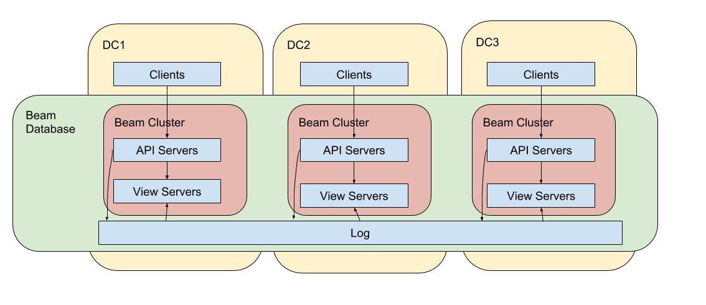

# HA & DR with Beam

The Beam documents don't explicitly talk about high availability (HA) and
Disaster Recovery (DR) much, but it's a fundamental feature of the architecture.

## A Production deployment

What would a production deployment of Beam that needs to be resilient to
failures, up to and including an entire datacenter look like? It could use a
single log cluster replicated across 3 datacenters (DCs). A cluster of Beam
views and API servers would be in each DC and interact with its local log
replicas.

The HA and DR properties of the single logical log are critical for the rest of
the system. The log would be replicated over a number of servers in each of the
3 or more DCs. A failure of a single server, or even an entire DC will not
affect the log in the other DCs, which can continue to service append and read
requests. The Raft consensus algorithm would be a good choice to build such a
log.

Each view server acts as a deterministic state machine. Two view servers with
the same configuration will arrive at the same state by independently applying
the same sequence of commands from the log. This simplifies a number of
operational aspects of Beam. To achieve HA, a production deployment will simply
run at least 2 instances of each partition configuration in each DC. To remedy a
failed view server, simply start another instance with the same configuration.
To repartition from 4 to 5 partitions, start view servers with the new
configurations, wait for them to catch up, and shut down old view servers.

Beam's API servers assume that view servers are unreliable. They expect that
view servers might go away, new view servers might appear, or that there might
be multiple partition sizes in flight at once. The API servers randomize all
requests across available view servers, and they hedge (race) requests to help
mask slow or failed views. The API servers themselves are stateless and can be
easily scaled up or down as needed.

Beam is designed around a single logical log to simplify many consistency
problems, including HA and DR. The foundation for these features has been part
of Beam from the very beginning. These are core features of the architecture,
not special cases to be added later.
