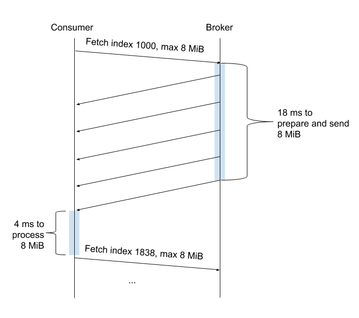
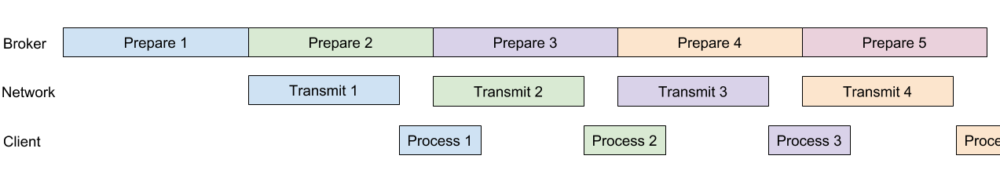
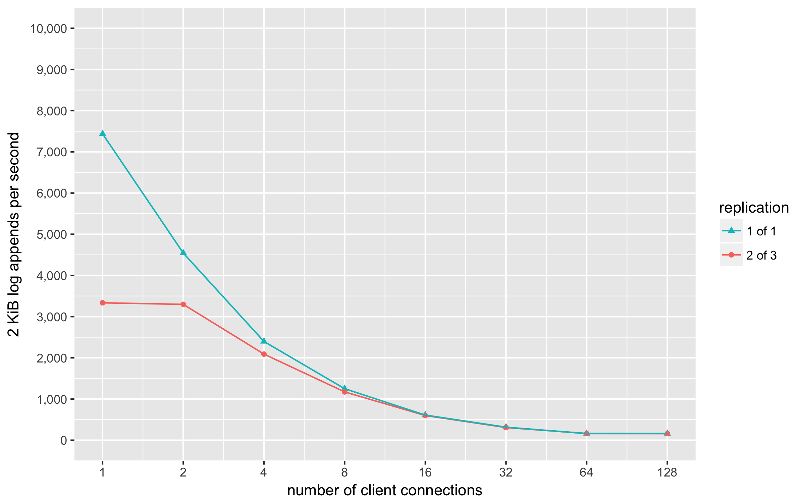
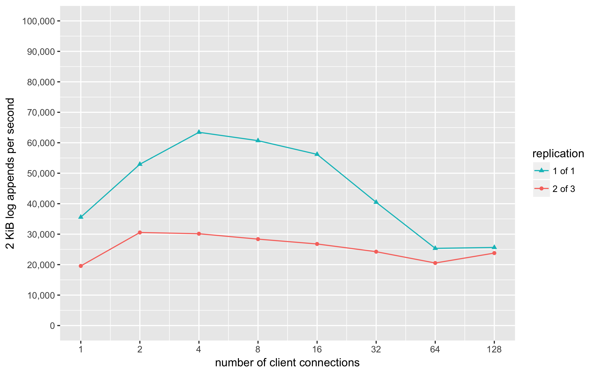

Using Apache Kafka in Beam
==========================

*This doc was written in March 2018 to discuss the use of Apache Kafka as a
replicated log in the Beam project. Some sections were redacted and edited
before making this public.*

Summary
-------

Beam relies on its log to store its incoming requests in a consistent
order. We used Apache Kafka as a plausible placeholder for the log in
ProtoBeam v1. During the ProtoBeam v2 effort, we more carefully
evaluated Kafka for this use case.

Although Kafka is commonly used as a message queue, it's implemented
much more like a replicated log. Unfortunately, we found significant
problems with using Kafka in this manner. Our recent experience with
Kafka has exposed significant problems with both reading and writing
from Kafka:

-   **Reading:** Kafka's protocol for consumers reading the log is
    inefficient. In our benchmarks, a single Kafka log consumer
    received only about half the throughput that the disks could
    provide. Worse yet, Kafka only reads from the leader broker; code
    changes would be needed to utilize the follower brokers for reads.

-   **Writing:** Kafka brokers don't implement group commit, so
    Kafka's log append performance will collapse with constant load
    spread across more clients. This would drastically limit our
    ability to scale out Beam's API tier.

Kafka could still work as Beam's log, but working through the issues
may be more trouble than it's worth. We plan to continue to use Kafka
during the ProtoBeam v3 effort. In parallel we will investigate our
options for Beam's log and try to determine the best path forward.

Beam's requirements for a replicated log
-----------------------------------------

Beam relies on its log to store its incoming requests in a consistent
order. Once the log externalizes a log entry to other views, Beam
depends on that log entry to be at that position in the log forever
after; otherwise, the views could diverge and the entire state could
become corrupt. Therefore, changes to the log need to be synchronously
persisted (to handle crashes and power outages) and synchronously
replicated (to handle machine failures).

Beam's log replication may need to span datacenters. We don't yet know
whether Beam will be deployed within a single datacenter or whether Beam
will need to span datacenters. If a Beam deployment is to span
datacenters, we plan to do that by replicating the log across
datacenters and running independent sets of Beam views in each
datacenter. This focuses the most of the cross-datacenter concerns on
the replicated log.

Beam's log should be accessible from various programming languages. The
Beam API tier and all of the views need to be able to access the log.
The API tier needs to append to the log, while most views only need to
read from the log. We want the flexibility to create views in various
languages to leverage existing code bases and exploit their relative
strengths. To do so, we need Beam's log to have support for many
languages, at least for reading.

These are the access patterns we anticipate on Beam's log:

1.  **Multiple readers tailing the log:** During normal operation in
    Beam, many views will be reading newly-written entries from the
    end of the log.

2.  **Multiple writers appending to the log:** During normal operation
    in Beam, multiple API servers with potentially high levels of
    concurrency will be appending requests to the log.

3.  **Long sequential reads:** When a view starts up, it will need to
    read a potentially large suffix of the log. Multiple views may
    start up in parallel, and they may read from different starting
    indexes in the log and at different speeds.

4.  **Prefix truncation:** Occasionally, the log will become too large
    to fit comfortably on its disks. Once Beam's persistent DiskViews
    have processed enough of the log, Beam will request that a prefix
    of the log be deleted. This topic of how views boot once the log
    has been truncated is covered in detail in the [Booting Beam
    Views](booting_beam_views.md) doc.

Beam's log will need to handle all of these scenarios, and they may all
happen concurrently in a Beam deployment.

Brief introduction to Apache Kafka
----------------------------------

Apache Kafka
([Wikipedia](https://en.wikipedia.org/wiki/Apache_Kafka))
was originally created at LinkedIn and open sourced in 2011. Kafka
became popular across the industry, and many of the original authors
started a company named Confluent in 2014 to continue developing Kafka.
Kafka runs on the JVM and is implemented in Java and Scala. An official
C/C++ client for Kafka called
[librdkafka](https://github.com/edenhill/librdkafka) is
the basis of
[bindings](https://github.com/edenhill/librdkafka#language-bindings)
for many other languages, and a third-party client called
[Sarama](https://github.com/Shopify/sarama) also exists
for Go.

Although Kafka is most often used as a message queue, it's implemented
much more like a replicated log, and it
[claims](https://kafka.apache.org/intro#kafka_storage) to
be suitable for a replicated log use case. For Beam, we are using a
single Kafka topic with a single Kafka partition as Beam's log. Kafka
servers are called brokers, and Kafka uses [Apache
ZooKeeper](https://en.wikipedia.org/wiki/Apache_ZooKeeper)
to elect a broker as leader for each partition. All appends to a
partition are received and ordered by its leader broker, which then
persists and replicates the new log entry to the follower brokers. For
Beam, we configure the brokers to acknowledge and externalize a log
append to clients only after the entry has been replicated to a majority
of the brokers and each of a majority of brokers has written the entry
safely to its disk. For example, in our test cluster, each entry is
durably written to 2 of 3 of the disks in the cluster before it's
acknowledged.

Kafka is particularly attractive for Beam because it's so widely used.
On paper, it appears to be a good fit for most of Beam's requirements.
We've used Kafka for ProtoBeam v1 and v2, thereby gaining some hands-on
experience with it, and we've benchmarked Kafka's performance for some
of the key Beam scenarios described above. The rest of this document
describes our benchmark results and discusses various concerns with
using Kafka in Beam.

Kafka performance evaluation
----------------------------

This section evaluates Apache Kafka's performance as a log for Beam:

-   The "Read performance" subsection focuses on the throughput of log
    reads (this is Scenario 3: "Long sequential reads").

-   The "Write performance" subsection focuses on the throughput of
    log appends (this is Scenario 2: "Multiple writers appending to
    the log").

We have not directly measured the performance for the other two
scenarios we identified above:

-   We assume that the performance for Scenario 1: "Multiple readers
    tailing the log" will be acceptable if the above two perform
    well.

-   Scenario 4: "Prefix truncation" is an occasional background event
    with no performance requirements.

We have chosen to focus this evaluation on throughput, rather than
latency, because we aren't aware of any strict latency requirements for
Beam. We are concerned about the log's ability to ingest large amounts
of data, as we expect the log append throughput to determine Beam's
overall write throughput.

This section omits many details of our configuration and benchmarks for
brevity. More details can be found in the appendix at the end of this
document.

### Read performance

This section focuses on how fast a Beam view can sequentially read a
large suffix of the log. Views will read potentially large suffixes of
the log when they start up, and reading a large part of the log may also
provide insights into the performance of tailing the log. As a baseline,
we first measured the performance of reading large files from disk.
Then, we measured the performance of reading large parts of the Kafka
log from Kafka clients, both locally and remotely.

#### Baseline: cat

To measure our servers' sequential read performance, we used cat on
some large files (that happened to be Kafka log files) and sent them to
/dev/null. These measurements were taken on a VM (4 VCPU, 8GB Ram, 40GB disk). The set
of files was large enough to exceed the RAM size of the VM, so we can
reasonably ignore caching effects.

We found that our servers' sequential read performance with cat varied
significantly depending on different Linux readahead settings. We
adjusted the readahead setting using
[blockdev](http://man7.org/linux/man-pages/man8/blockdev.8.html),
ranging from its default of 128 KiB all the way up to 8 MiB. Disk read
throughput at various readahead settings is shown in the following table
(rounded to the nearest 5 MiB/sec):

| **Readahead Size**               | **Read Throughput** |
|--------------------------------- |-------------------- |
| 128 KiB (default)                | 320 MiB/sec |
| 256 KiB                          | 405 MiB/sec |
| 512 KiB                          | 510 MiB/sec |
| 1 MiB (used in all other tests)  | 555 MiB/sec |
| 2 MiB                            | 660 MiB/sec |
| 4 MiB                            | 710 MiB/sec |
| 8 MiB                            | 775 MiB/sec |

The results show that the default read-ahead setting of 128 KiB leaves a
lot of disk bandwidth on the table. We adjusted it to 1 MiB, which we
think is still a conservative number for this workload. With readahead
of 1 MiB or more, the SSDs perform quite well, exceeding the read
throughput of a spinning disk by 5-8x.

The Kafka server will not only have to read the log, but it'll also
have to send it over the network. We measured the network performance
in our test cluster with [iperf3](http://software.es.net/iperf/) at 1090
MiB/sec, so Kafka's sequential log read performance shouldn't be
limited by the network bandwidth. Therefore, we'd hope to see a Kafka
consumer be able to read a large suffix of a remote log at a rate of
around 500 MiB/sec or more.

#### Kafka benchmark

The following table summarizes our benchmark results (rounded to the
nearest 5 MiB/sec):

| **Client**  | **Read  Throughput**   |             |             |             |
|-------------|------------------------|-------------|-------------|-------------|
|             | **Local, Cached**  | **Local, Uncached**  | **Remote, Uncached** | **Remote, Uncached** |
| Java        | 195 MiB/s   | 180 MiB/s   | 150 MiB/s   | 150 MiB/s   |
| Rust using  [rdkafka](https://github.com/fede1024/rust-rdkafka) [BaseConsumer](https://docs.rs/rdkafka/*/rdkafka/consumer/base_consumer/struct.BaseConsumer.html) | 895 MiB/s   | 455 MiB/s   | 345 MiB/s   | 320 MiB/s   |
| Go using [Sarama](https://github.com/Shopify/sarama) |  630 MiB/s   | 325 MiB/s   | 270 MiB/s   | 235 MiB/s   |

More details on each client can be found in the appendix at the end of
this document. The "Local" scenarios run the client on the same VM as
the broker; they are only interesting for comparison. The "Remote"
scenarios run the client on a different VM. The "Cached" scenarios
read the first 2 million log entries, which fit in the broker's OS disk
cache. The "Uncached" scenarios read the entire log, which is too
large to fit in the broker's OS disk cache.

We think the "Remote, Uncached" scenario will be the most
representative of a Beam view booting. The "Remote, Cached" scenario
may be more representative of Beam views tailing a growing log.

The table presents the best numbers we can currently measure in each
language. We've tried many other options and have seen varying results:

-   In the past, we have seen the Java client perform better (up to 460
    MiB/sec on a local uncached benchmark). We think its performance
    dropped when we updated to the Kafka 1.0 version of the Kafka
    protocol. We haven't looked into this.

-   We also tried a Rust-native Kafka library called
    [rust-kafka](https://github.com/spicavigo/kafka-rust).
    It doesn't implement the latest Kafka protocol needed to leverage
    the processor's CRC32C instruction for checksumming. Even with
    checksumming disabled, it did not perform as well as rdkafka.

-   We initially tried rust-rdkafka's StreamConsumer. Due to a
    [performance bug](https://github.com/fede1024/kafka-benchmark/issues/5)
    (using an unbuffered channel instead of a buffered channel), this
    was much slower than the BaseConsumer. We think this was fixed
    upstream recently, but the BaseConsumer is fine for us right now.

-   We haven't tried
    [confluent-kafka-go](https://github.com/confluentinc/confluent-kafka-go),
    the client for Go that Confluent officially supports. This library
    is a wrapper around librdkafka, the same library that our Rust
    tests use. It's possible that confluent-kafka-go could exceed the
    performance of Sarama, but it's also possible the expensive
    crossings between Go and C would negate any benefit.

Almost all of the numbers in the table are much lower than we'd like.
Rust with librdkafka performs the best, but even that one in the
"Remote" scenarios is 200 MiB/sec lower than we'd like. Somehow,
reading the disk through the Kafka broker on localhost is slower than it
should be, and sending the data over the network is much slower than
that.

#### Kafka's inefficient consumer protocol

Reading the Kafka log does not perform nearly as well as reading the
broker's disk or sending data over the network. To our surprise, the
benchmarks aren't all CPU-bound, either: they're limited by Kafka's
network protocol.

The following diagram shows communication pattern between a Kafka
consumer and a Kafka broker. The blue rectangles indicate heavy CPU
usage. This diagram is annotated with approximate timings when using the
Rust rdkafka client on a cached local run (cached remote runs are
similar but may do more processing before sending any reply packets).



The consumer pulls data from the broker with a series of Fetch requests.
Each Fetch request specifies the index in the Kafka log from which to
start reading, as well as a maximum message size for the reply. Upon
receiving the request, the broker does some processing, then streams out
the result, apparently interleaving more processing as it sends the
data. During this time, each of the three clients we looked at will
simply buffer the reply, waiting until it has received the entire reply
before processing it. Once the client receives the entire reply, it then
has to look through the entire message to determine how many log entries
it contains; this information is not readily available at the start of
the message. Then, it can send out the next Fetch request, setting the
start index to the previous start index plus the number of log entries
in the previous response.

The problem with this protocol, coupled with these client
implementations, is that the client is idle while the broker is working,
and the broker is idle while the client is working. They both have
significant computation to do:

-   The broker has to assemble a response. It has to read from the right
    files and offsets on disk or in the disk cache. We believe our
    Kafka brokers used sendfile() during these benchmarks, thereby
    pushing some work down to the OS and avoiding some context
    switches or buffer copies. Still, the time it took the broker to
    send the reply would indicate the broker still has significant
    computation (it took 18ms to prepare and send an 8MiB reply on
    localhost).

-   The client has to decode the entire packet, which contains many
    variable-length fields. We believe our 3 client implementations
    also check the CRC32C checksums on the response before sending out
    the next Fetch request.

#### Better consumer implementations/protocols

One could imagine a better client implementation would begin processing
the reply as it was streaming in. However, none of these three client
libraries do this. It may be too complex to implement or not a priority
for the authors of these client libraries. Considering we're including
two official Kafka client libraries in our tests (the Java one and
librdkafka), we can only assume that consumer throughput from a single
partition isn't a priority for Kafka overall.

Instead of streaming, one could imagine a better protocol that was
pipelined using large messages as a unit of work, like this:



The broker could prepare a full message before sending it, and the
client could buffer that in its entirely before processing it. This may
be simpler to implement than getting both the broker and client to
stream out/in messages. With this pipeline, the slowest resource (the
broker, in the figure) would determine the throughput, and the other
resources would overlap with it.

There are a few possible ways to achieve this pipeline:

-   As a small tweak to the existing Kafka protocol, imagine if the
    client could send "Fetch next" requests. It could send these
    upon receiving the previous reply or even ahead of that time.

-   As another possible tweak to the existing Kafka protocol, imagine if
    the client could limit the reply not only by bytes, but also by
    the number of entries in the message. So a client could send
    "Fetch index 1000, limit 1000", then without processing the next
    reply, send "Fetch index 2000, limit 1000".

-   Or better yet, if Kafka used gRPC, a [Server Streaming
    RPC](https://grpc.io/docs/guides/concepts.html#server-streaming-rpc)
    would be a great fit here. That would allow the client to make one
    request, which would trigger the server to send back a series of
    replies. The client could then process each reply as a whole, and
    the underlying protocol would take care of flow control (slowing
    the replies down to the speed of the client, if necessary).

#### Read performance conclusion

In the best case, we've seen Kafka remote read performance in the range
of 250-350 MiB/sec, while our disks can read at 500-800 MiB/sec. Sadly,
Kafka's consumer protocol was not designed for high throughput. The
results aren't so bad that Kafka is entirely unusable for Beam, but it
is a significant concern.

### Write performance

This section focuses on how fast the log can handle appends coming from Beam's
API tier. We measured the throughput of log appends in Kafka, comparing both a
single-broker Kafka cluster and a three-broker Kafka cluster.

#### Kafka write benchmark

To test Kafka's write performance, we created a client program called
"kafkaw", or affectionately "calf cow". It repeatedly sends Produce
requests to the Kafka leader broker for a topic, using variable levels
of concurrency. It initiates multiple client connections, keeping only
one outstanding Produce request per connection. For each connection, it
spawns multiple goroutines (lightweight threads) that each try to append
to the log. When multiple goroutines issue appends on the same
connection and the previous Produce request is still in flight, the
client library batches them together into the next Produce request.

We used 2 KiB values to append to the log. We configured Kafka to
durably write to disks before acknowledging each append. We ran the
client on a single VM and ran the Kafka brokers each on separate VMs.

In this benchmark, we spawned 128 goroutines but split them over varying
numbers of client connections. On the left side, we have 128 goroutines
on 1 connection, then 64 goroutines on each of 2 connections, etc, going
all the way out to 1 goroutine on each of 128 connections. This
simulates a constant write request rate coming into Beam API servers,
and what Beam's overall write throughput would look like as we scaled
up the number of API servers. The ideal implementation of group commit
would result in a nearly flat line, where the throughput was not
dependent on the number of client connections.



The "1 of 1" replication shows a Kafka topic that resides on only the
leader broker with no replication to follower brokers. The "2 of 3"
replication shows a Kafka topic where each entry must be durably written
to the leader broker and at least one of two follower brokers before
acknowledging the client.

Unfortunately, the overall log append throughput collapses as we spread
the write load over more client connections. The problem is that Kafka
brokers do not implement group commit. On the left-hand side of the
curve, the Kafka client is able to batch together many goroutines into
larger Produce requests. On the right-hand side of the curve, the Kafka
client can't; the broker receives small Produce requests and does
nothing to collect them together.

This behavior drastically limits the scalability of Beam's API tier.
Even if we only scale out Beam's API tier to a few servers, we will
have given up most of Kafka's potential log append throughput.

-   With many connections and a single goroutine each, the single broker
    receives a continuous stream of Produce requests, each with a
    single 2-KiB request. It writes durably to its disk but does so
    one log entry at a time.

-   With 1 connection shared among 128 goroutines, the client library
    batches writes together into much larger Produce requests. We
    expect the goroutines to end up in two groups; one group will be
    part of the Produce request that's in flight, while the other
    will be queuing up to go out as part of the next Produce request.
    As a rough estimate, suppose each group had 64 goroutines, so each
    Produce request is made up of 128-KiB. The broker receives a
    nearly continuous stream of Produce requests, with gaps in between
    to round-trip back to the client. The broker writes 128-KiB
    durably to its disk at a time.

#### Discussion: faster hardware

Fast enough durable disk writes could change Kafka's scalability
properties. As an experiment, we ran the same benchmark as before but
with fsync disabled. In this configuration, Kafka acknowledged the
Produce requests as soon as they reached the OS buffer cache and met
their replication requirements. This is unsafe for Beam but may give us
an upper bound in performance.

The following graph shows the throughput like before, offering a
constant load of 128 appends split over an increasing number of client
connections. Note the y-axis goes up to 100 thousand here but only 10
thousand before.



The shape of these curves is drastically different. The curve without
replication looks like it reaches some other problem after about 8
clients, but we're not too concerned with that for now. The curve with
replication looks much healthier in that it's nearly flat: the log
append performance does not depend on how many client connections we
distribute the requests on.

This suggests that drastically faster durable disk writes could both
increase performance substantially and could effectively mitigate
Kafka's lack of group commit.

#### Discussion: implementing group commit

The basic concept behind implementing group commit is simple. The broker
would do the following (ignoring replication for simplicity):

1.  Pull all the Produce requests off a queue.

2.  Append all the new entries into the log file maintained in the OS
    buffer cache.

3.  Invoke fsync on log file.

4.  Reply to all the Produce requests.

This will be more complicated in Kafka for the following reasons:

-   Kafka needs to support replication, and different Produce requests
    may specify different replication requirements (see 
    [Kafka protocol documentation](https://kafka.apache.org/protocol.html)).

-   Kafka's Produced requests can specify any number of topics and
    partitions on which to append data. Errors returned are on a
    per-topic-partition basis.

-   Kafka appears to use a threading model where each request is
    assigned to a Java system-level thread, and this thread runs the
    request to completion. For a large number of client connections,
    this may require a large number of threads, which could lead to
    other engineering challenges.

Another possibility would be to implement group commit in a proxy
sitting right in front of the leader broker. This could help Beam get
most of the performance of having group commit in Kafka, without having
to modify Kafka broker code. However, it'd be quite a kludge and would
leave some performance on the table. It might also interact poorly with
Kafka's exactly once semantics (see the discussion on "Duplicate
Appends" below).

#### Write performance conclusion

Kafka's log append throughput collapses when more than a couple of
clients submit requests. This is because Kafka brokers don't implement
group commit. The Kafka project does not see durable writes as important
(they suggest disabling fsync calls), but they are necessary to ensure
Beam's consistency in the face of correlated log server crashes. If
Beam is to use Kafka as its log, we will need to address this serious
problem.

Additional concerns about Kafka
-------------------------------

This section discusses additional concerns and considerations about
using Apache Kafka in Beam. We haven't explored these in as much detail
yet, but they are certainly relevant to the discussion of evaluating
Apache Kafka for Beam's replicated log.

### Duplicate appends (at-most-once semantics)

When a Beam API server sends a request to be appended to the log, we'd
like that to end up as a single entry in the log. Sometimes, however,
the request or the response will be lost (the TCP connection will be
broken), and the API server won't know what happened. It'll need to
retry the request. If the request was lost in transit, no harm is done,
but if the reply was lost, then the request would end up creating
multiple log entries. Depending on the semantics of the request and what
other operations were taking place concurrently, this may pose a
problem.

This problem is a fundamental one in any distributed system, and it's
generally solved like this:

1.  The client opens a session with the server, establishing a session
    ID. (If this session establishment is duplicated, it only wastes a
    small amount of memory but doesn't do much harm.)

2.  The client includes its session ID and a request ID with every
    request.

3.  If the server receives a duplicate request ID for the same session
    ID, it does not re-process the request. The server usually replies
    back with the earlier response.

4.  The client usually needs to send keep-alive messages during periods
    of inactivity to keep its session active.

5.  Eventually, once the server gets tired of holding state for the
    client, it deletes the session. Subsequent requests with that
    session ID are then rejected.

With respect to Beam's log, there are several ways this could be
implemented. The duplicate requests could be filtered out on production
before they are appended to the log, or they could be filtered out on
consumption as they are read from the log. To filter them out during
production, we require support from the log implementation; to filter
them out during consumption, this could be implemented in the log itself
or as part of every Beam log consumer. Of course, we'd prefer if this
complexity was all handled by the log implementation.

Kafka recently added features for "exactly-once" semantics, which we
believe would solve this problem for Beam. With this enabled, Kafka
brokers will filter out duplicate requests on the production side,
before they end up in the log. This requires some changes to producer
clients to send over session and request IDs, too. These features are
explained in a Kafka [blog post](https://www.confluent.io/blog/exactly-once-semantics-are-possible-heres-how-apache-kafka-does-it/)
and [design doc](https://docs.google.com/document/d/11Jqy_GjUGtdXJK94XGsEIK7CP1SnQGdp2eF0wSw9ra8/edit).
Unfortunately, they have intermingled a design for cross-partition
transactions there too, along with a discussion about how this extends
to Kafka streams, neither of which are relevant for Beam at this time.

The implementation of "exactly-once" semantics was added to Kafka
brokers and the Java client in v0.11, released in June 2017. As of this
writing, the implementation for the librdkafka client is still
[planned](https://github.com/edenhill/librdkafka/issues/1308),
and the discussion about supporting this in Sarama is
[ongoing](https://github.com/Shopify/sarama/issues/901).

For Beam, we plan to wait on this issue for now. We think Kafka's new
features will work for Beam once more client support exists. We prefer
to wait until the client libraries have better support for this, and if
it becomes blocking for us, we will consider modifying the clients
ourselves. For now, this hasn't affected our ability to develop
ProtoBeam.

A related discussion is that, at least before the "exactly-once"
feature set, Kafka did not guarantee FIFO Client Order. FIFO Client
Order states that if a client submits m1 then m2, m2 won't precede m1
in the log. We don't plan to make use of FIFO Client Order for Beam, so
this isn't an issue for us.

### Reading from follower brokers

When Beam views boot, they may need to read a substantial suffix of the
log. It could be useful during this time to offload the leader broker by
letting follower brokers serve these reads. Then, once the views are
caught up to the end of the log, they could move over to tailing the log
from the leader broker directly.

Surprisingly, Kafka does not support this. Their
[stance](http://grokbase.com/t/kafka/users/13bvf0rsk1/consuming-from-a-replica)
appears to be that topics should have many partitions; load will be
well-balanced across brokers because each broker will be the leader for
many partitions. This isn't the case for Beam, however, which uses only
one partition to obtain a simple global ordering of requests.

There is a special way that Kafka clients can read from follower
brokers, introduced in [KAFKA-432](https://issues.apache.org/jira/browse/KAFKA-432?attachmentOrder=asc).
Based on that patch, if a client passes a Broker ID of -2 in its Fetch
request, instead of the usual value of -1, it should be allowed to read
from follower brokers. However, we have not attempted this, and both
[librdkafka](https://github.com/edenhill/librdkafka/blob/24e4fae8c54c4d7f5ab5326a1b6fa2f8d163682f/src/rdkafka_broker.c#L3032)
and
[Sarama](https://github.com/Shopify/sarama/blob/5e8fd95863bd4a894fcd29225547d56967f189ad/fetch_request.go#L44)
hardcode the value to -1.

Beam may not need this optimization. If it does turn out to be
important, we will probably need to modify Kafka's client libraries.

### Kafka's wire protocol

One limitation of Apache Kafka is that the project uses its own
serialization format. At first we didn't think this would be a serious
issue, and it's a fairly simple encoding. However, it brings a number
of problems:

-   The
    [description](https://kafka.apache.org/protocol.html#protocol_details)
    (and
    [here](https://kafka.apache.org/documentation/#recordbatch))
    is written in English, often in paragraph form, and is usually
    imprecise and incomplete.

-   Client libraries must hand-roll large amounts of code just to invoke
    simple RPCs. For example, serializing the simple DeleteRecords
    request and response and testing this required us to write 
    [over 350 lines of Go](https://github.com/Shopify/sarama/pull/1027/files).

-   Wireshark has support for decoding the Kafka protocol, but it can't
    decode the latest versions of some of the messages. The C parser
    needs to be updated.

-   The semantics of some messages have changed in subtle ways over
    time, leading us to encounter difficult bugs like 
    [Issue 1032](https://github.com/Shopify/sarama/issues/1032#issuecomment-364288209)
    in Sarama.

-   Client libraries are more difficult to update, so they tend to lag
    behind the Java/Scala library on the latest protocol features,
    like CRC32C (earlier versions of Kafka used IEEE CRC) and
    "exactly-once" semantics.

For Beam, this protocol decision has significantly harmed our ability to
access the latest Kafka features from multiple languages and to debug
correctness and performance issues.

The hand-rolled protocol would also make it harder for us to extend
Kafka's functionality. Realistically, we may want the log to filter
entries or extract parts of log entries on behalf of readers. For
example, a secondary index view may only be interested in one particular
field of a particular data type, not every log entry. Filtering out the
unnecessary data at the log server could save network bandwidth.
However, Kafka makes adding this functionality especially difficult
because it's hard to extend the Kafka protocol.

Alternatives to Kafka
---------------------

Apache Kafka is appealing because it's widely used, but there are other
alternatives. Admittedly, we haven't spent much time looking at these
yet, since Kafka was our initial choice.

[Apache BookKeeper](https://bookkeeper.apache.org/docs/latest/getting-started/concepts/)
is a distributed log service used at a handful of companies, including
Twitter and Salesforce. Like Kafka, it uses ZooKeeper to maintain
metadata about logs and coordinate changes to the storage servers. While
not as popular as Kafka, BookKeeper may be more focused on use cases
like Beam's. One problem, however, is that the client library for
BookKeeper embeds quite a lot of functionality, and we're not aware of
support for non-Java languages. We would like to avoid having a proxy
between Beam views and the log, yet we wouldn't want to restrict Beam
to Java-only views.

[CORFU](https://www.usenix.org/conference/nsdi12/technical-sessions/presentation/balakrishnan)
is a research paper published in 2012 that proposes an alternative
architecture for a shared distributed log. For log appends, a single
sequencer server hands out the next log index by incrementing a local
integer, then the writer stores its data at the servers that own that
log index. This should have an overall throughput much larger than
Kafka, for example, since the single bottleneck is only a volatile
integer, not a persistent log. Several of the authors of CORFU moved
onto VMWare Research and have released
[CorfuDB](https://github.com/CorfuDB/CorfuDB), which
appears to contain an implementation of CORFU. We don't know much about
this implementation, whether it's production ready, and what the
operational implications would be.

We've also considered building our own log using the 
[Raft algorithm](https://raft.github.io/). 
In this case, we would likely leverage an existing open source
Raft implementation. Such a log implementation could meet all of Beam's
requirements, but it would take our time away from working on Beam
itself.

Conclusion
----------

Although Kafka was initially attractive for storing Beam's log, our
recent experience with Kafka has exposed significant problems with both
reading and writing:

-   **Reading:** Kafka's protocol for consumers reading the log is
    inefficient. In our benchmarks, a single Kafka log consumer
    received only about half the throughput that the disks could
    provide. Worse yet, Kafka only reads from the leader broker; code
    changes would be needed to utilize the follower brokers for reads.

-   **Writing:** Kafka brokers don't implement group commit, so
    Kafka's log append performance will collapse with constant load
    spread across more clients. This would drastically limit our
    ability to scale out Beam's API tier.

Kafka was designed like a replicated log for a storage system, but it's not
commonly used that way. We think the issues we're seeing are because the focus
on Kafka lately has been on broader use cases, which don't seem relevant for
Beam.

Kafka could still work as Beam's log, but working through the issues
may be more trouble than it's worth. We plan to continue to use Kafka
during the ProtoBeam v3 effort. In parallel, we will investigate our
options for Beam's log and try to determine the best path forward.

Appendix: benchmark configuration/script
----------------------------------------

All VMs ran on Openstack. Unless otherwise stated, we used
VMs with 4 VCPU, 8GB ram, 40GB disk, with local SSDs. The OS was Ubuntu 16.04.

The OS readahead setting was set to 1 MiB for all tests (unless
otherwise noted) by issuing the following command as root:
/sbin/blockdev --setra 2048 /dev/vda

We ran 3 Kafka brokers using kafka\_2.11-1.0.1.tgz (released
2018-03-05). The Java runtime was openjdk-9 JRE/JDK version
9\~b114-0ubuntu1. We ran 3 ZooKeeper servers on the same VMs.

We made only a few changes to Kafka's default broker configuration. The
options are documented
[here](https://kafka.apache.org/documentation/#brokerconfigs).
Our tests did not use TLS. The following changes were made to Kafka's
default configuration:

```
 +auto.create.topics.enable=false
 -broker.id=0
 +default.replication.factor=3
 +delete.topic.enable=true
 -log.dirs=/tmp/kafka-logs
 +log.dirs=/var/lib/kafka
 -log.retention.hours=168
 +log.retention.hours=87600
 +message.max.bytes=11010048
```

We use a single Kafka topic with a single partition, created as follows:

> \~/kafka/bin/kafka-topics.sh --create --topic beam --if-not-exists
> --zookeeper localhost:2181 --partitions 1 --replication-factor 3

For the tests involving single-broker Kafka clusters, the
--replication-factor was set to 1 instead.

For the write benchmarks, the topic was further configured as follows
(documentation
[here](https://kafka.apache.org/documentation/#topicconfigs)):

| **Topic setting** |    **Durability on (most tests)** | **Durability off (where noted)** |
|--- |---- |---- |
| min.insync.replicas |  1 for single-broker cluster, 2 for three-broker cluster  | |
| delete.retention.ms |  1 | 1 |
|  flush.messages  |      1 | infinity |
|  flush.ms        |  infinity | infinity |

This command helps with determining which broker is the current leader
(all reads and writes go to the leader):

> \~/kafka/bin/kafka-topics.sh --zookeeper localhost:2181 --topic beam
> --describe

### Kafka read benchmark

The data we used was a mix of 20M data points packed into
\~8.4M Kafka entries totalling \~17,250 MiB uncompressed.

| **Configuration** |**Command** |
|--- |--- |
| Java | \~/kafka/bin\$ ./kafka-consumer-perf-test.sh --zookeeper kafka01:2181 --topic beam --threads 1 --messages 8400000 |
|Rust using [rdkafka](https://github.com/fede1024/rust-rdkafka) [BaseConsumer](https://docs.rs/rdkafka/*/rdkafka/consumer/base_consumer/struct.BaseConsumer.html) |  \~/protobeam/dist/rust-rdkafkasink  --base-consumer --fetch-message-max-bytes=8388608 kafka01:9092 |
| Go using [Sarama](https://github.com/Shopify/sarama) | \~/protobeam/bin/kafkasink -cfg \~/protobeam/dist/cluster.json |

The "cached" tests read only the first 2 million entries in the log.
Each cached test was run once to prime the broker's disk cache, then
the numbers were recorded from the second run. The "uncached" tests
read the entire \~8.4 million entries in the log -- far too many to fit
in cache.
