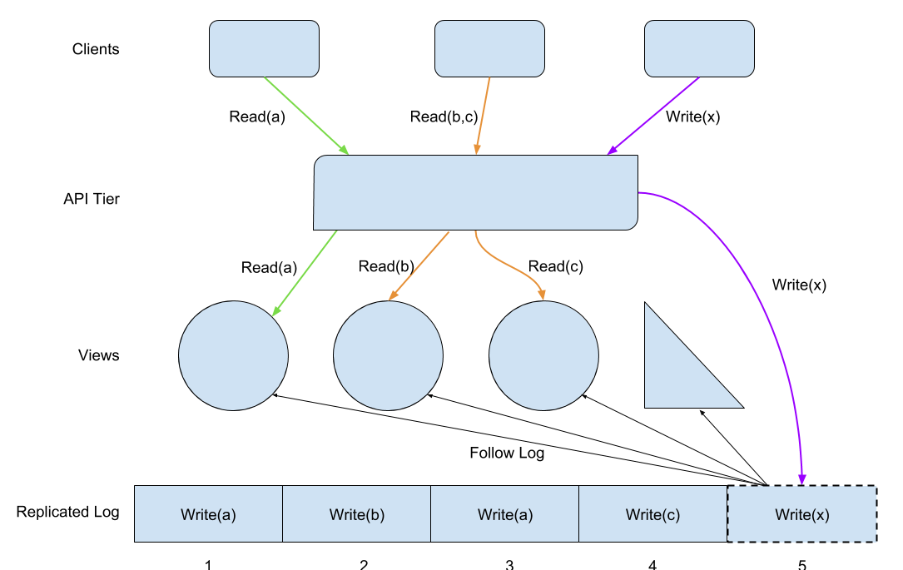
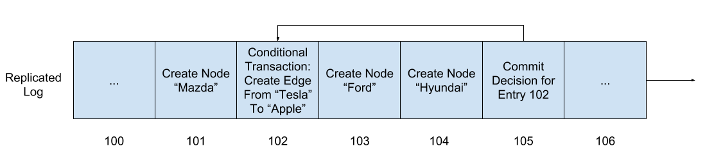
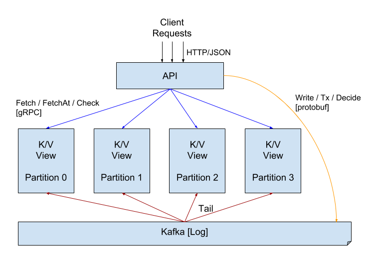

ProtoAkutan V1
==============

*This document was written at the start of the project in November 2017 to
describe the proposed architecture. Some sections were redacted and edited
before making this public.*

Akutan Architecture
-------------------

Akutan is based around a single **shared log**. To modify the state,
clients submit a request into this log, which is persisted and
replicated. Multiple **views** follow the end of the log and apply the
requests in order and deterministically. Clients then query these
separate views to read the state. Clients submit both their requests and
their queries through an **API tier**.

The overall architecture is agnostic to the type of store you want: you
could build a hash-partitioned key/value store, you could build a graph
database, or you could build a small blob store. Your log entry formats,
views, and API layer dictate what the client sees.

A key feature of the Akutan architecture is to support many types of
views. If a new client needs to query the data in a different way, the
best solution may be to create a new view. Views can take various
shapes. Some views may resemble primary stores, keeping documents or
graph nodes and edges. Some views may resemble database indexes, and
others may resemble materialized views. Some views may provide caches,
while others may cover the entries state. The state may be partitioned
across views, or it may be partitioned with overlap (redundancy) for
more efficient queries. Some may be disk-based, others RAM-based, others
both. We'll use the API tier to hide implementation details and
changes in views from our clients.

These are the steps involved in processing a read query:

1.  The client submits a read query to the API tier.

2.  The API tier consults its knowledge of the view types and the
    current topology to determine which view(s) are best suited to
    handle the query.

3.  The API tier submits the query to the view(s).

4.  The views respond to the API tier.

5.  The API tier collects the results and replies to the client.

The section below on Snapshot Isolation describes how Akutan implements
queries against a consistent snapshot of the state. In short, the API
tier provides each view with the exact log index at which to query.

These are the steps involved in processing a write request:

1.  The client submits a write request to the API tier.

2.  The API tier appends this request to the replicated log and waits
    for an acknowledgment.

3.  The API tier replies with the log index to the client.

4.  In parallel, the views are each individually following the end of
    the log. When they see the request, they apply it to their current
    state (or ignore it, if it's not relevant for that view).

More complex writes, such as those with pre-conditions, are described in
the section below on Transactions. In short, these require a pair of log
entries: the first log entry captures the intent of the write, then the
API tier checks the pre-condition just before that log index, then writes a
second log entry that captures the outcome (whether the pre-condition
was met).

Akutan borrows many ideas from 
[Tango: Distributed Data Structures over a Shared Log](http://www.cs.yale.edu/homes/mahesh/papers/tangososp.pdf)
(Microsoft Research, SOSP'13). However, we aren't aware of production
systems that implement exactly this approach.

### Downsides of a Single Log

Akutan's foundation is a single shared log. This simplifies many features
but also brings its own challenges. Specifically, this section describes
the challenges of dealing with an ever-growing log and the single log's
impact on overall system performance.

#### Log Growth and Compaction

One concern is that the log could grow to be quite large, exhausting log
storage capacity or causing views to take too long to start up. The
first of these, log storage capacity, is easy to extend with more disks,
so we think the concern about view startup time is more serious.

If the views are taking too long to start up, it's because they need to
read too much data to extract the useful bits they need. To solve this,
they could take on an additional responsibility of writing their state
more compactly outside the log, so that on their next startup, they can
load this state more directly, then apply only the remainder of the log.

There are different approaches to how the views could persist their
state. With a snapshotting approach, all the live data is written out in
bulk in one go. This is simple but can require bursts of significant
resource usage. With a more incremental approach, such as log cleaning
or LSM trees, the data is written out and updated in small chunks. This
is usually preferable for large amounts of data.

Eventually, the log itself will become too large, and throwing more
disks at it may stop being practical. In that case, we will need a view
to create an alternative representation of the entire log state that
could support the rest of the system, including bootstrapping new views
for the first time. This will require agreement on some sort of
retention policy for intermediate log states (if we keep all the
intermediate states, there is no way to compact the log).

#### Log Performance

Another concern is that the log could become a performance bottleneck.
This could manifest in two ways: the log may not be able to append
entries quickly enough, or the views may not be able to read entries
from the log quickly enough.

There are a few ways to implement a replicated log:

-   More naively, one could use a single consensus group. Based on
    [Hadoop's benchmarks](https://wiki.apache.org/hadoop/ZooKeeper/Performance)
    of ZooKeeper and 
    [Diego's benchmarks (p145)](https://github.com/ongardie/dissertation/blob/master/online.pdf?raw=true)
    of LogCabin, we believe a consensus-based log should be able to
    append low 10s of thousands of requests per second with a 1 Gbps
    network.

-   A specialized log like Kafka can append 
    [80,000 log appends per second](https://engineering.linkedin.com/kafka/benchmarking-apache-kafka-2-million-writes-second-three-cheap-machines)
    with 1KB entries. Its read throughput can reach 10 to 100s of
    thousands of reads/second.

-   A highly specialized log like Corfu can support 200,000 log appends
    per second with 4KB entries (see
    [p1](http://www.cs.yale.edu/homes/mahesh/papers/corfumain-final.pdf)).
    Its read throughput scales with cluster size to at least 100s of
    thousands of 4KB reads per second.

### Snapshot Isolation and Transaction Processing

This section describes the details of implementing snapshot isolation
and transactions in Akutan. The replicated log in Akutan enables a very
simple form of versioning for the entire state, since the log index
identifies the version. This allows for a simple implementation of MVCC
(multi-version concurrency control). Views track prior versions of the
state and allow queries at a particular log index. To query the latest
version of the state (in a
[linearizable](http://www.bailis.org/blog/linearizability-versus-serializability/)
fashion), the API tier first determines the log index at the current end
of the log, then queries views at this particular index. Clients can
read from any number of views over long periods of time and observe a
consistent snapshot of the entire state.

The replicated log also enables a fairly simple form of transactions,
which is described in Section 4.1 of the Tango paper. For a very simple
case, the shared log allows for modifying multiple state objects
atomically simply by appending a single request to the shared log (for
example, "write x=3 and y=5" in the same log entry).

However, this single log entry is insufficient for many real-world
transactions, which have preconditions that must be validated before the
transaction may commit. For example, "create an edge between Tesla and
Apple" may only succeed if the Tesla and Apple nodes already exist. What
if Tesla is partitioned in one view but Apple is partitioned in another?
Both may need to track the edge, but neither has the knowledge required
to decide the outcome of the transaction.

To handle this case, Akutan uses a second log entry called a *decision
entry*:

1.  The API tier first proposes a conditional transaction by appending
    an entry in the log at position *T* (*102* below).

2.  Then, the API tier evaluates whether its precondition has been met
    as of *T* by querying the views. In this example, it checks
    whether the "Apple" node exists as of index 102 and whether the
    "Tesla" node exists as of index 102.

3.  If so, the API tier appends a *commit decision entry* in the log,
    indicating that the change described at *T* should indeed take
    effect at *T.* If the precondition fails, it appends an *abort
    decision entry* instead.

Until a view sees the decision entry, it does not know whether to
process or ignore the conditional transaction entry. For example, while
the view holding the Tesla node is at position 103 in the log, it does
not know whether there exists an edge from Tesla to Apple then, and it
may not be able to process some queries about Tesla. In the common case,
we expect a decision entry to be appended quickly. If the decider is
taking too long, other participants, such as the views, may append an
Abort decision first. (Views apply only the first decision entry for a
given transaction and ignore any subsequent decision entries for that
same transaction.)

An Encouraging Start: ProtoAkutan v1
----------------------------------

The first prototype we built explored the primary areas of interest from
the architecture, including:

-   How the clients, API tier, views, and log interact,

-   How basic reads and writes perform,

-   How easy is it to implement and understand cross-view transactions,
    and

-   How transactions perform.

ProtoAkutan v1 uses a single Kafka topic to store the log. We implemented
a hash-partitioned view over a key-value space, and a front-end API tier
that allows for reads, writes, and transactions.

Each view consists of one large hash table, consisting of 1/n-th of the
key-value pairs. Each view follows the end of the log and updates its
hash table when it sees log entries that affect its keys.

The views maintain the entire history of each key: each key has a list
of \[log index, value\] pairs. This allows for snapshot isolation for
queries, even across views/partitions: clients can do a consistent
point-in-time query across keys that span multiple partitions. In
addition, the views implement processing of the transaction model
described above.

The ProtoAkutan v1 code is written in Go.
It uses Protobuf as the serialization format for the
log entries. The views expose a gRPC API for use by the API layer, and
the API layer exposes a JSON/HTTP API for clients to use. The entire
project is less than 2,000 lines of code and was built in a few days.

We deployed ProtoAkutan v1 on a test cluster. We used 6 medium VMs
(2 VCPU, 6GB Ram, 30GB disk): 1 VM for Kafka and ZooKeeper, 1 VM for the
API layer, and 4 VMs for view partitions.

We ran a few simple benchmarks on the cluster:

-   Time to write 1M random 8 byte key with 8 byte values: 18 seconds
    (\~55K writes/sec).

-   Using a cluster with 40M log entries with each view containing \~10M
    keys, it takes \~195 seconds to restart a view and have it process
    the entire log (\~200K reads/sec).

-   Using the same 40M key cluster as above, the system achieved 3k/sec
    cross-partition transactions (read from 2 different partitions,
    write to 3rd), with a 20ms p90 latency. Running the same test on a
    MacBook Pro reaches 7k/sec, so it seems like there's plenty of
    scope for improvements to this transaction rate if needed.

The outcome from the v1 prototype was favorable. The implementation was
quick and straightforward. Performance was better than we expected from
a quick prototype on resource-constrained VMs. The global log/ordering
makes understanding the correctness and behavior of the cross-view
actions easier than other approaches. We didn't discover anything that
would rule it out as a viable approach, and we're eager to push our
prototype forward.

Next Steps: ProtoAkutan v2
------------------------

To further explore the Akutan architecture, we next plan to build a v2
prototype. We plan to explore remaining areas of investigation, as well
as move towards data/processing closer to what we think we'll need.
There are three major topics:

-   **Log compaction:** We think the log may grow to a somewhat large
    size because of the rate of change to the product catalog. This
    would make it slow for views to apply the entire history when they
    start up, so we want to gain a better understanding of log
    compaction. We think implementing this in the prototype is the
    best way to learn about it.

-   **Disk-based views:** We probably want to store the data on disk, rather
    than in RAM. We want to explore larger data sets than what v1 could support
    in RAM, and we want to begin to understand the performance properties of
    having to read and write to disk.

-   **Graph data model:** While v1 was based around simple key-value pairs, we
    want to move to this graph-based data model in v2, in large part because it
    will more effectively show how Akutan could meet more complex requirements.
