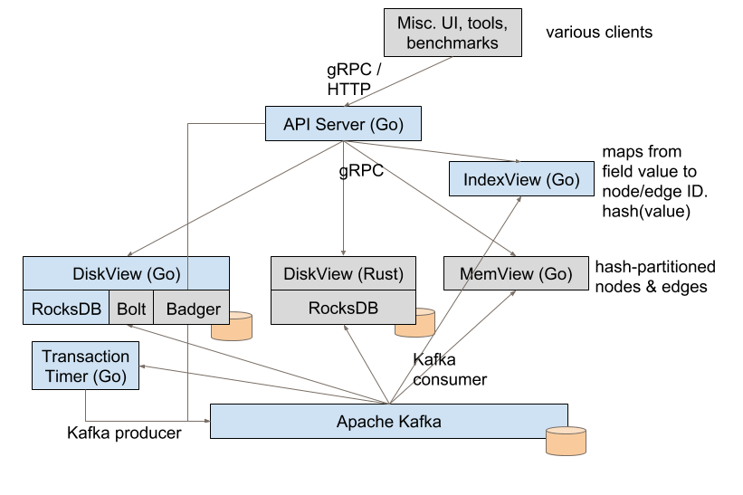

ProtoAkutan v2
==============

*This doc was written in March 2018 as an update to what we've implemented and
learned from ProtoAkutan v2. Some sections were redacted and edited before making
this public.*

ProtoAkutan v1 recap
====================

The [first doc](protoakutan_v1.md) on Akutan proposed the basic architecture of
Akutan, consisting of a collection of views on top of a single, replicated log.
The single, replicated log simplifies many operations including transactions; it
also introduces downsides, like fundamentally limiting the rate of change for
data in the system. The first doc described our initial prototype, ProtoAkutan v1,
which implemented an in-memory key-value store.

At the end of the first doc, we set out to explore three major topics in
ProtoAkutan v2:

-   **Log compaction:** We think the log may grow to a somewhat large size
    because of the rate of change to the data. This would make it slow for views
    to apply the entire history when they start up, so we want to gain a better
    understanding of log compaction. We think implementing this in the prototype
    is the best way to learn about it.

-   **Disk-based views:** To support larger data sets, we probably want to store
    the data on disk, rather than in RAM. We want to explore larger data sets
    than what v1 could support in RAM, and we want to begin to understand the
    performance properties of having to read and write to disk.

-   **Graph data model:** While v1 was based around simple key-value pairs, we
    want to move to this graph-based data model in v2, in large part because it
    will more effectively show how Akutan could meet more complex requirements.

ProtoAkutan v2
==============

For ProtoAkutan v2, we basically kept with the plan of exploring those
major topics: log compaction, disk-based views, and the graph data
model. We also evaluated the open-source projects that ProtoAkutan
currently depends on.

We covered a lot of surface area in ProtoAkutan v2. Rather than fit
everything we learned into this document, we've split out two of the
major findings into more focused documents:

1.  [Using Kafka in Akutan](kafka.md) evaluates whether Apache Kafka is a good fit
    for Akutan's log. It concludes that Kafka has significant limitations for use
    in Akutan, which we'll need to address in the future.

2.  [Booting Akutan Views](booting_views.md) describes how Akutan views start
    up after a prefix of Akutan's log has been discarded. It argues that most
    views can boot from the Disk View's Iteration Service without much
    additional complexity.

The remainder of this section covers information not found in the above links.
It discusses the data model that v2 exposes, and the different components that
make up the v2 implementation.

Graph data model and API
------------------------

The data model in ProtoAkutan v2 is a property graph made up of nodes and
directional edges, where both nodes and edges have potentially large
values.

Dangling edges are not permitted in the graph: every edge A-->B is
written as a transaction that's conditional on A and B existing. This
requires two log entries, as described in the first Akutan doc. As an
optimization, if A, B, and A-->B are written in the same request,
ProtoAkutan v2 appends this to the log as a single log entry.

ProtoAkutan v2 also supports arbitrarily complex transactions. This
enables splitting and merging of nodes while maintaining reasonable
semantics on what happens to their edges. However, it's not a capability
we exercised beyond single-edge transactions.

ProtoAkutan v2 maintains all versions of every node and edge. It doesn't
support deletes, but we would implement this using "tombstones",
explicit markers that a node or edge had been deleted. All queries are
executed against a consistent snapshot of the entire graph, and any
query can specify a particular log index to identify an older snapshot
to query.

In addition to the property graph, ProtoAkutan v2 supports a form of
secondary indexes. When configured explicitly, a set of Index Views will
maintain a map from a particular field within node values or edge
values, allowing a user to look up node IDs or edge IDs by exact matches
on this field.

System components
-----------------

The components of ProtoAkutan v2 are shown in the following diagram. The primary
components are highlighted in blue; the rest are shown in gray.

ProtoAkutan v2 stores all the nodes and edges in DiskViews. The nodes and
edges are hash-partitioned across a set of DiskViews. An edge A-->B
is hashed onto the same DiskView instance as node A, which makes graph
traversals more efficient.

ProtoAkutan v2 includes two implementations of the DiskView: one in Go and
one in Rust, which we used to compare performance. The Rust
implementation is not entirely complete: it does not implement graph
traversals and cannot boot from other DiskViews. The Go DiskView is
complete and also has three implementations for writing to disk; the
[Disk View performance](#disk-view-performance) section below compares
these.

The IndexView creates a secondary index on a field within node or edge
values. Which field to index is specified in the instance's
configuration. We used JSON values in ProtoAkutan v2, and the IndexView
extracted the values with [JSONPath](https://github.com/oliveagle/jsonpath)
expressions.

The IndexView turned out to be more complex than expected. In addition to its
primary map from field value to node/edge ID, it keeps a reverse map from
node/edge ID to field value. The reverse map is used when a node/edge is changed
to find which field values that node/edge used to have. The IndexView can also
be queried at any log index, it applies transactions without blocking other
updates, and it's hash-partitioned by field value. Each of these adds more
complexity. At this point, we don't know whether the IndexView was uniquely
complex or if more views in the future might be similarly difficult.

The other components are as follows:

-   The MemView in v2 is based on the one from v1, but adapted for the property
    graph model.

-   The Transaction Timer view centralizes the logic for aborting stale
    transactions, so that it does not become the responsibility of every view.

-   The API server is extended from v1 but adapted for the property graph model.
    It now exports gRPC & HTTP interfaces (v1 was only HTTP).

-   The use of Apache Kafka is similar to in v1. Whether it is suitable for Akutan
    is addressed in the [Using Kafka in Akutan](kafka.md) doc.

Disk View performance
---------------------

As part of the v2 prototype, we wanted to explore larger data sets by
storing the data on SSDs, rather than in RAM. The primary location for
data in v2 is the Disk View, which keeps nodes and edges in a persistent
embedded key-value store.

The DiskView's functionality is captured by three main scenarios:

-   **Random Write**: Graph nodes and edges are written to the embedded
    key-value store upon tailing Akutan’s log. These writes need not be
    immediately durable, as entries can be reapplied from Akutan's log after
    restarting from a crash.

-   **Random Read**: The graph API supports the ability to read a number of
    nodes and edges by their IDs, as well as traversing the graph from any node.
    This results in random reads on the embedded key-value store.

-   **Iterate:** As explained in the [Booting Akutan Views](booting_views.md)
    doc, Akutan relies on an iteration API that reads key-value pairs sequentially
    from the embedded key-value store.

In ProtoAkutan v2, we implemented the DiskView in Go with the ability to
use different embedded key-value stores. We compared three open-source
embedded key-value stores for this purpose, across the three main
scenarios identified above. The key value stores we looked at each used
a different set of data structures, disk layouts, and algorithms to
persist the data. Each layout results in a trade-off of performance
characteristics, allowing us to make a selection based on use cases.

1.  [BoltDB](https://github.com/boltdb/bolt) implements a copy-on-write
    [B+Tree](http://delivery.acm.org/10.1145/360000/356776/p121-comer.pdf?ip=216.113.160.71&id=356776&acc=ACTIVE%20SERVICE&key=37B0A9F49C26EEFC%2E37B0A9F49C26EEFC%2E4A8375174E621EE3%2E4D4702B0C3E38B35&__acm__=1522278532_a0fa93a393b42c81a2b3d601a496ddb4)
    in Go. It stores tree nodes out of order in pages in a file, tracking which
    pages are used and which are free (described
    [here](https://github.com/boltdb/bolt/issues/308#issuecomment-74811638)).
    Values are written only to leaf nodes in the tree, while smaller branch
    nodes index into those. Bolt is optimized for random reads, assuming the
    branch nodes are mostly cached in the OS page cache.

2.  [RocksDB](https://github.com/facebook/rocksdb/) uses an 
    [LSM (Log Structured Merge) Tree](https://www.cs.umb.edu/~poneil/lsmtree.pdf)
    to focus on write throughput. It writes all new values sequentially to large
    files. In the background, it sorts, merges, and rewrites these files to
    enable O(log n) random reads.

3.  [BadgerDB](https://github.com/dgraph-io/badger), based on
    [WiscKey](https://www.usenix.org/system/files/conference/fast16/fast16-papers-lu.pdf),
    also uses an LSM tree but only to store keys. It writes values separately to
    large sequential "value log" files. In the background, it compacts the keys
    in the LSM and separately rewrites sparse values in the value log more
    densely. Badger by default keeps a copy of all the keys in RAM; while this
    choice may be expensive, it ensures that random reads require only a single
    disk access.

We began evaluating the three embedded key-value stores in our test cluster, but
we're unable to present definitive results at this time. We found the random
read performance in our test VMs limiting. This makes it difficult to get a
complete picture of the performance from these embedded key-value stores.

Our preliminary results did point towards RocksDB as the likely winner:

-   BoltDB was very slow for random writes.

-   BadgerDB was slow at iteration, since iteration requires random disk
    reads from Badger's value log.

-   RocksDB performed well for random writes and iteration. With some more
    tuning, it also performed well for random reads on a Macbook Pro.

Conclusion
==========

For ProtoAkutan v2, we set out to explore log compaction, disk-based views, and
the graph data model. We built a transactional property graph store that could
hold billions of items. With the index view booting from the DiskView's
Iteration Service, we showed how the architecture can support in-memory views,
even when old entries from the log have been discarded.

We also evaluated some of the open-source projects that ProtoAkutan currently
depends on. We found that Kafka has serious limitations for Akutan that we will
need to address in the future, but that RocksDB seems like a good choice for the
DiskView to leverage.
