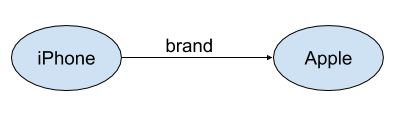
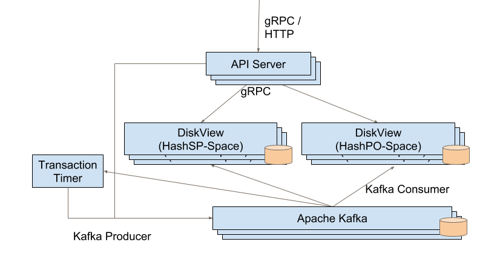
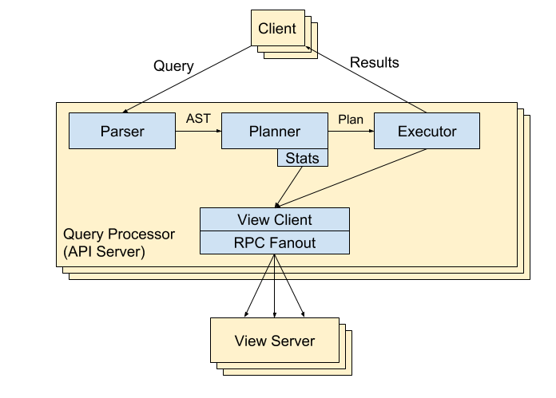
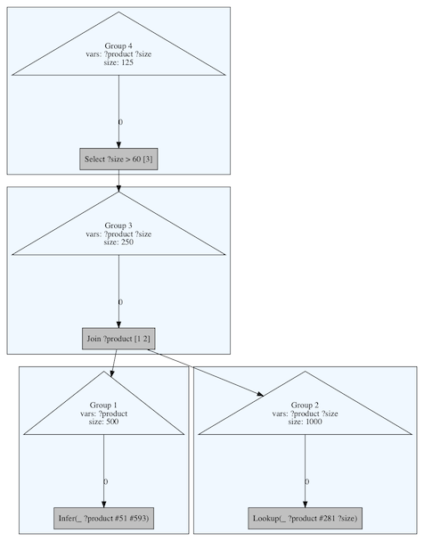
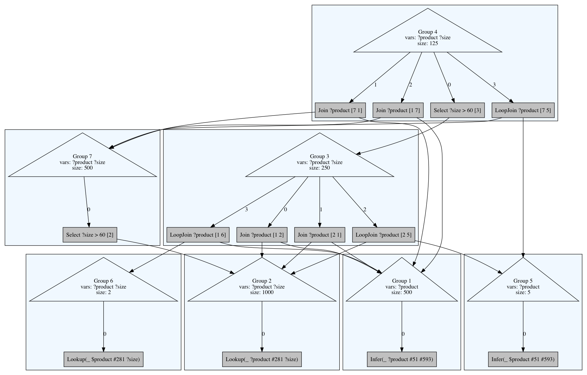
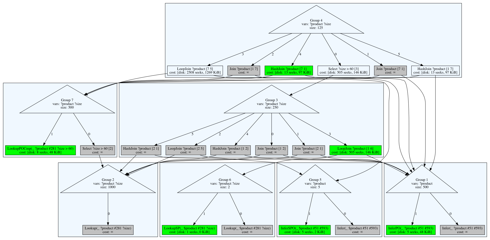
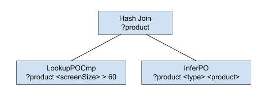
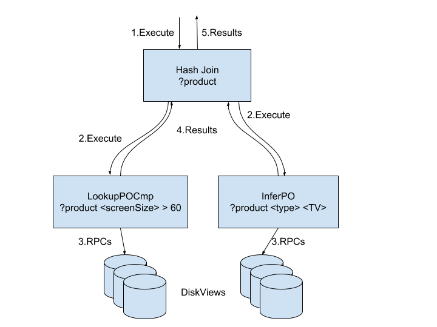
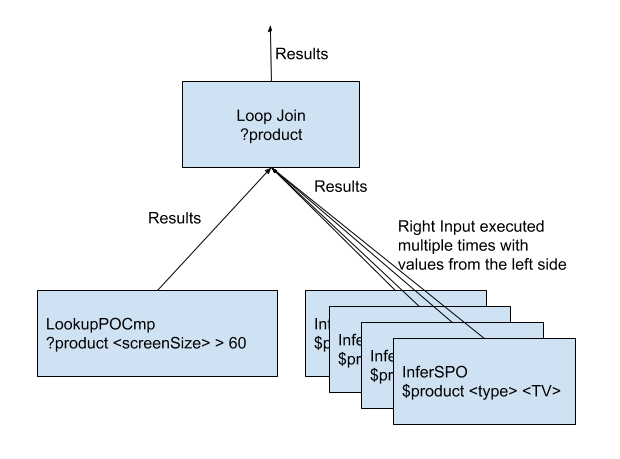

ProtoBeam v3
============

*This doc was written in August 2018 as an update to what we've implemented and
learned from ProtoBeam v3. Some sections were redacted and edited before making
this public.*

Background
----------

[ProtoBeam v1](protobeam_v1.md) introduced the Beam architecture for building a
distributed database:

-   Change requests are appended to a single persistent and fault-tolerant log,

-   Multiple heterogeneous view servers follow the log and apply changes to
    their local state, and

-   An API tier collects data from relevant views to answer queries.

To quickly demonstrate the usefulness of this architecture, ProtoBeam v1
implemented a small key-value store that supported snapshots and
transactions across partitions.

[ProtoBeam v2](protobeam_v2.md) explored various aspects of the Beam
architecture in more depth while implementing a property graph store. It stored
nodes and edges, each consisting of arbitrary JSON values. To query ProtoBeam
v2, you'd specify a starting node ID and could traverse edges or reverse edges
outwards from the starting node. ProtoBeam v2 also implemented secondary
indexes, so you could look up which nodes and edges have JSON fields matching a
given value.

ProtoBeam v3 implements a fact-based data model similar to a triple store. We
believe this data model will work just as well as a property graph for many use
cases, and also allow for semantic reasoning over the graph.

Introduction
------------

In ProtoBeam v3, we aimed to explore the major areas of a triple store. Of
course, we could not finish a complete triple store with a reasoning engine in
ProtoBeam v3; implementing a feature-complete store with great performance will
be a much longer journey. However, we specifically designed ProtoBeam v3 to be
extensible and to *enable* high query performance. It implements just enough
functionality to support most useful queries, and it contains solid abstractions
to enable high performance as the system evolves. The system has clear paths for
implementing new functionality and for improving performance.

ProtoBeam v3 continues to build on the Beam architecture. The architecture
allows for adding new types of views as a way to add new features or optimize
performance, so it's a good fit for our goals. Because we already explored this
aspect of the architecture in ProtoBeam v2, v3 uses only a minimal set of view
types. We plan to add more types of views later if needed to support
high-performance queries.

The main focus of ProtoBeam v3 was a whole new query processor in the API
server. The API server in ProtoBeam v2 was far too limited to support
[Sparql](https://en.wikipedia.org/wiki/SPARQL) style queries, as it could only
handle simple queries with a fixed execution plan. The new query processor in v3
is much more sophisticated. It consists of a parser, a cost-based query planner,
and a parallel execution engine. This allows the API server to handle much
richer queries, where the best execution plan depends on the shape of the data.
The API server is structured to be extensible in the queries it can support, the
plans it can consider, the operations it can execute, and the types of views
from which it can gather data. It's also built with batching and streaming
throughout for high performance.

Data Model
----------

The graph is a collection of facts, but what exactly is a fact?
A fact, or triple, is a simple statement about something of the form:

        Subject Predicate Object

Some examples could be `<iPhone> <brand> <Apple>` or `<California>
<located In> <USA>`. Here, the strings between angle brackets (such
as \<iPhone\>) are unique identifiers for those entities in the graph.
The Object of a fact may also be a literal value rather than another
entity, e.g. `<Apple> <label> "Apple Inc."`.

A fact can also be thought of as an edge in a graph from its subject to
its object, labeled by its predicate:



### Literals

A fact can have an object that is another node in the graph, or it can
be a literal value. ProtoBeam v3 supports the following typed literals:

| Type       | Description                 |
|---         |---                          |
|  String    | An arbitrary Unicode string |
|  Int64     | An 8-byte signed integer    |
|  Float64   | A double-precision floating point number |
|  Bool      | True or False |
|  Timestamp |  A variable-precision timestamp, consisting of a point in time as well as an indication of its precision. For example, you can use this to describe everything from just a Year to a full Year / Month / Day / Hour / Minutes / Seconds timestamp. |

### Additional Fields in a Fact

In addition to \<subject\> \<predicate\> \<object\>, ProtoBeam v3 stores
two additional fields for each fact: an ID and the log index at which it
was created.

Each fact is assigned a unique ID. This Fact ID can itself be the
subject of other facts, so that you can have facts about facts, called
*metafacts*. For example, metafacts can be used to encode the source of
facts:

  | Fact ID | Subject    | Predicate    | Object        |
  |---------|----------  |----------    |-------        |
  | **A**   | \<iPhone\> | \<brand\>    | \<Apple\>     |
  | B       | **A**      | \<found in\> | \<Wikipedia\> |

Treating metadata as just additional facts simplifies the query language
and engine: they don't need special cases for metadata.

Metafacts could also be used to encode the confidence of facts or that
facts are valid for particular time spans. However, ProtoBeam v3 does
not have any special support for this information. It will return all
facts in results, unless the query explicitly filters out low-confidence
facts.

The second additional field kept with every fact is a log index. In the
Beam architecture, the log index is a strictly increasing number that
identifies a version of the entire dataset. Alongside each fact,
ProtoBeam v3 stores the log index of the entry that created the fact.
This enables queries on historical snapshots of the entire graph.

### Query Language

The primary read operation for ProtoBeam v3 is via a query language. A query
defines a set of patterns, and the query result is 0 or more sets of facts that
satisfy these patterns.

Queries are written using the same format as facts. A very simple query
could be:

        <iPhone> <brand> <Apple>

If this fact is true, then it would be returned from the query. If it's
not true, the results would be empty.

More useful queries look for multiple facts related in some way. A `?` is
used to denote a variable in a query. When the same variable is present
in multiple lines, it's bound to the same value. The following example
(the \"large TVs query\") shows a query for entities that are of type
\<TV\> and have a \<screenSize\> greater than 60:

```
?product <type> <TV>
?product <screenSize> ?size
?size <gt> 60
```

We will refer to this example throughout this document. Note: ProtoBeam
v3 includes partial support for units and languages, but we've omitted
that here for simplicity.

The large TV query might return many result sets, including these two:

```
1.  <LG_OLED_P18> <type> <TV>
    <LG_OLED_P18> <screenSize> 65
    65 <gt> 60

2.  <LG_OLED_P1875> <type> <TV>
    <LG_OLED_P1875> <screenSize> 75
    75 <gt> 60
```

It's important to note that the query is looking for facts that are
true and not just facts that are stored. Some facts can be inferred from
other facts at query time and need not be persisted. For example, the
`<gt>` predicate is used to perform a greater than comparison on literal
values. These can be evaluated at query time and don't require a
persisted fact indicating that 65 is greater than 60. The later section
on [Query Execution: Inference](#inference) explains how
facts are inferred for transitive predicates.

System Components
-----------------

ProtoBeam v3 is based on the same Beam architecture as in earlier
versions:

-   Change requests are appended to a single persistent and
    fault-tolerant log,

-   Multiple heterogeneous view servers follow the log and apply changes
    to their local state, and

-   An API tier collects data from relevant views to answer queries.

Its major components are shown in the following diagram:



The API server is vastly improved from ProtoBeam v2 and is discussed in the
[Query Processing](#query-processing) section. The Transaction Timer, which
aborts slow transactions, and the use of Apache Kafka as the log are essentially
the same as in v2. In evaluating ProtoBeam v2, we [identified](kafka.md) several
problems with Apache Kafka; however, addressing these was out of scope for v3.

ProtoBeam v3 uses only a minimal set of view types to support graph queries. One
type of views allows efficient lookups of facts given a subject and predicate,
and a second type allows efficient lookups of facts given a predicate and
object. These are both implemented using a single Disk View code base, which can
be run in the two different modes. The Disk View is based on that of ProtoBeam
v2 but was substantially modified for this role.

The views serving subject-predicate lookups are organized in a
hash-space called the "HashSP-space", where each "HashSP" server
contains the facts whose hash(subject+predicate) fall within a
contiguous range. The views serving predicate-object lookups are
organized in a similar hash-space called the "HashPO-space", where
each "HashPO" server contains the facts whose hash(predicate+object)
fall within a contiguous range. The hash spaces are split across
multiple servers to scale capacity and reads, and each hash is assigned
to multiple servers for fault-tolerance.

### Disk Views

The Disk Views store facts in a local RocksDB key-value store. They
convert the fact into a byte array which is stored as the key; the value
is left empty. There are two key formats: one for the HashSP space and
one for the HashPO space.

The HashSP servers create a key using the fields in the following order:

`<Subject> <Predicate> <Object> <FactID> <LogIndex>`

The HashPO servers store the fields in a different order:

`<Predicate> <Object> <Subject> <FactID> <LogIndex>`

RocksDB exposes the stored keys in key order, allowing the Disk View to
efficiently find keys with matching prefixes to perform lookups. For
example, to match the query line,

`<LG_OLED_P1865> <screenSize> ?size`

a HashSP server would iterate RocksDB keys starting at the prefix of
`<LG_OLED_P1865> <screenSize>` and stopping once the prefix no
longer matches.

The Disk Views encode object literals in keys such that a
lexicographical ordering of the keys results in the natural ordering of
the objects. For example, a key with Int64(-100) will be ordered before
a key with Int64(1). This allows for the Disk View to efficiently
perform lookups that do comparisons on the object value. For example,
the query lines

```
?product <screenSize> ?size
?size <gt> 60
```

can be answered by a lookup on the HashPO servers by iterating RocksDB
keys starting at `<screenSize>` 60 and ending past the `<screenSize>`
prefix.

The Disk Views have additional mechanisms to execute lookups in the face
of a changing log, pending transactions, and historical queries. Each
lookup request contains a log index at which to query, identifying a
version of the entire graph. The Disk Views serve a lookup at
index T with the following sequence:

1.  If the Disk View has not processed up through index T in the log,
    wait.

2.  If any keys affecting the lookup are undecided due to an ongoing
    transaction, wait.

3.  Run a RocksDB iterator for the lookup, filtering out facts with log
    index greater than T, and stream the results to the client.

We expect that steps (1) and (2) will require no waiting for most
queries, but the checks are necessary to ensure consistency.

The HashSP and HashPO Disk Views perform a number of lookups that are
used by the query engine:

|  | **SP Key Format**             |
|-----------------  |---           | 
| LookupS           | All facts with this subject. |
| LookupSP          | All facts with this subject and predicate. |
| LookupSPO         | All facts with this subject and predicate and object. (The HashPO views could service LookupSPO too, but ProtoBeam v3 does not use them.) |


|  | **PO Key Format**  |
|---                |---|
|  LookupPO         |   All facts with this predicate and object |
|  LookupPOCmp      |   All facts with this predicate, and having an object that meets the comparison criteria. |

As the views with the SP key format are hash partitioned on hash(subject +
predicate), the LookupS operations require the API tier to fan out the request
to each partition in the hashSP space to find the all results. Similarly, the
LookupPOCmp operation is fanned out to each partition in the hashPO space. The
[RPC Fanout](#rpc-fanout) section has more details on this.

Logically, LookupP could be implemented with the PO Key Format as well.
We've yet to discover queries that would require it, so it's not
currently implemented. Adding LookupP would be straightforward if we
discover it's useful; its implementation would be very similar to
LookupS.

The Disk Views also support exporting their data through carousels as in
Protobeam v2, and they collect statistics about the data, as described
in the [Query Planner](#planner) section.

### Possible Future Views

While ProtoBeam v3 leans heavily on the two types of Disk Views for answering
queries, we anticipate needing additional views in the future for both
additional functionality and higher performance. This section describes our
present ideas.

The current LookupPOCmp operation allows looking up entities with a label that
has a given prefix. For example, a query can request all entities with labels
starting with "Pana", and it will get back results including the brand
Panasonic. However, as the data sources are messy, we probably also want to
query for entities with labels similar to "Pantsonic" \[sic\]. Doing so
efficiently requires special data structures, so it would necessitate a custom
type of view.

Additional types of views could provide higher performance. This could
go in many different directions and is probably best done after seeing
motivating requirements. These are a few examples:

-   To improve lookup latency, create a view that's functionally
    similar to a Disk View but keeps its data in memory. Apply it to a
    subset of the data.

-   Pre-partition the dataset by type.

-   Maintain indexes that combine multiple facts about an entity.

-   For inference queries, materialize transitive facts.

Query Processing
----------------

The main focus of ProtoBeam v3 was a whole new query processor in the API
server. This allows the API server to handle the kind of rich queries needed.

As shown in the figure below, the query processor consists of a parser,
a cost-based query planner, and a parallel execution engine. The parser
transforms an initial set of query lines into an abstract syntax tree
(AST). The planner combines the AST with statistics about the data to
find an efficient query plan. The executor then runs the plan, using
batching and streaming throughout for high performance. The executor
relies on a View Client / RPC Fanout module to collect data efficiently
from the views.



The query processor is structured to be extensible in the queries it can
support, the plans it can consider, the operations it can execute, and
the types of views from which it can gather data. We developed the query
processor for the graph queries, but the architecture is a general one
that should be equally suitable for other types of stores. In fact, the
basic structure and approach resembles that of many relational and
distributed databases.

### Parser

The query parser produces an AST from a multi-line query string. The
following is an example of an AST for the "large TVs" query:

```
Query{
    Quads: [
        Quad {
            ID: Nil,
            Subject: Variable("product"),
            Predicate: Entity("type"),
            Object: Entity("TV")
        },
        Quad {
            ID: Nil,
            Subject: Variable("product"),
            Predicate: Entity("screenSize"),
            Object: Variable("size")
        },
        Quad {
            ID: Nil,
            Subject: Variable("size"),
            Predicate: Operator(OpGreater),
            Object: LiteralInt((int64) 60)
        }
    ]
}
```

ProtoBeam v3's parser is implemented using
[goparsify](https://github.com/vektah/goparsify), which is
a [parser combinator](https://en.wikipedia.org/wiki/Parser_combinator)
library. The parser combinator approach involves building up named
sub-parsers and combining them together to form a complete parser.
There's no strict separation between lexical analysis and parsing, and
sub-parsers can be unit tested independently of how they're used. This
makes it easy to extend and re-use pieces of the parser as the syntax
evolves.

### Planner

ProtoBeam v3 has multiple ways to execute a single query. For example,
when finding large TVs, it can:

1.  Start from the TV entity, find the products with that type, and see
    which of those products have screen size greater than 60;

2.  Start from entities with screenSize greater than 60, then see which
    of those are TVs; or

3.  Find the products that are TVs, find the entities with screenSize
    greater than 60 in parallel, and take the intersection of both
    lists.

Which plan is best depends on the shape of the data. Do most entities
with large screens happen to be TVs? How many TVs have screens sized
smaller or larger than 60?

ProtoBeam v3 uses a cost-based query planner to choose how to execute a
query. It considers many possible plans that would produce equivalent
results, estimates the costs of each plan, and chooses the plan with the
lowest estimated cost. It generates candidate plans using a rules-based
approach. We show how the planner works by using the large TV query as
an example.

First, the planner mechanically converts the AST from the query parser
into an equivalent tree of logical operators. It produces a tree of Join
operators connecting all the Lookups and adds Selection operators at the
root of the tree. Here's the tree representing the large TV query:



Here, \<type\> is represented as #51, \<TV\> as #593, and
\<screenSize\> as #281. Also note that "size" refers to the estimated
result set size, while "?size" is a variable in the query.

Second, the planner applies logical equivalence rules to generate new
expressions. Each group (a blue rectangle in the diagram) has one or
more logically equivalent expressions that would produce the same
results. To generate these, the planner includes rules for associating
and commuting joins (to change the join order) and a rule to push
selection down the tree. It also has a rule for applying Loop Join
transformations, where the inner (right-hand) node is different than
that of the logical Join operator, since it has variables bound to the
outer (left-hand) node. The resulting tree for the large TVs query is
shown in the following diagram:



Third, the planner applies physical implementation rules to generate
physical operators, forming executable plans. It has rules for
implementing various Lookup and Infer requests, implementing logical
Joins as Hash Joins, and collapsing a Select above a Lookup into a
LookupPOCmp operation (a range query). The following very small diagram
shows the full search space, with the lowest cost sub-plans highlighted
in green. It has the same equivalence groups as above, but the
implementable groups now include physical operators that can be
executed.



Finally, the planner extracts the plan with the lowest estimated cost.
For the large TVs query with an empty dataset, it extracts the following
plan (with the string labels substituted in for readability):

```
    HashJoin ?product
        LookupPOCmp(_ ?product <screenSize> ?size > 60)
        InferPO(_ ?product <type> <TV>)
```

This plan tells the executor to run a range query for entities with
large screen sizes in parallel with a search for all TVs. It will build
a hash-set of entities with large screen sizes and return all the TVs
that are found in that set.

The rules-based approach and "memo" structure with groups shown above
come from [Volcano](http://www.cs.cornell.edu/~mshong/DDG_Fall05/Volcano.pdf)
(written by Graefe and McKenna in 1993; follow-up work includes Columbia
in 1995 and Cascades in 2001). We chose to use this rules-based approach
because it's extensible. We can add new rules and new operators to
implement new kinds of queries, views, or optimizations, and the same
basic approach will support these. For example, we added the LookupPOCmp
optimization with one implementation rule and one new physical operator;
the rest of the planner does not have any knowledge of this.

The alternative to a rules-based approach is a bottom-up approach, and
many successful relational databases have bottom-up query planners.
These can be more efficient (for example, at enumerating join orders),
but they are hand-crafted for a well-understood set of optimizations and
heuristics. New optimizations and operators could be difficult to
integrate with a bottom-up approach. The top-down approach in ProtoBeam
v3 helps promote the system's extensibility. Its query planner may be
expensive compared to a bottom-up query planner, but we believe its
extensibility will enable the overall system to perform better.

To find a good plan, the planner needs reasonable estimates for the cost
of each operator (see 
[Selinger, *et al*](http://citeseerx.ist.psu.edu/viewdoc/download?doi=10.1.1.450.7113&rep=rep1&type=pdf),
1979). It does this in three stages:

1.  In the background, the views maintain statistics about their data.
    The DiskViews periodically read through their entire dataset to
    loosely update various statistics, and the API servers request
    these later. For example, the hashSP views count the number of
    facts for each subject-predicate pair and report the pairs with
    large counts.

2.  During logical exploration, the planner uses these statistics to
    estimate result sizes. For example, when sizing a Lookup request
    with a fixed subject and predicate, the statistics provide the
    count for large result sizes. If an entry is missing from the
    statistics, the planner assumes the result size will be small.

3.  For each physical (sub-)plan, the planner applies a simple cost
    model that estimates the disk resources needed to execute the
    plan. It currently ignores CPU, memory, network, and parallelism
    factors, but these can be added later as needed. The goal of the
    cost model is not to be exact, which would be nearly impossible,
    but to distinguish a good plan from a bad one.

We think the query planner in ProtoBeam v3 has a good structure to keep up with
the systems growing demands. It's only the beginning: we will need to extend the
rules, statistics, and cost model over time, and we may even need to add
heuristics and optimize the core search algorithm. Having a good structure in
place now gives us a clear path for adding functionality and for improving its
performance in the future.

### Execution

Once the planner has selected a plan, the executor runs it. The executor
builds a tree of operators with the same shape as the plan tree. Each
node in the tree performs that particular operation. A node that depends
on one or more child nodes for input triggers the execution of each
child node as it is required. Result data is streamed out of each node
and flows up the tree. Many of the leaf operators in the tree are lookup
operations implemented by the Disk Views (e.g. return all facts that
have this particular subject and predicate).

Consider the plan shown earlier for the large TVs query:



This plan results in the following execution tree:



Once the execution tree is built, it's started by executing the root
node of the tree. In this case as it has 2 inputs that it needs data for
it'll turn around and execute those 2 input nodes. The leaf nodes will
make RPC calls to the relevant Disk Views to perform the necessary
lookups. As the Disk Views find matching facts, they will stream chunks
of results back to the operator node, which will forward these to its
results stream. The Hash Join will find the intersection between the two
inputs to generate its results.

We implemented a number of features to improve performance of these
query executions:

1.  RPC requests to a single view server are done in batch (e.g. do
    these 5 LookupSP requests at once), which can help reduce the
    per-request overhead and number of round trips. This especially
    useful for lookups that return only a few facts. In those cases
    the network round trip time is significantly larger than the
    actual index read operation.

2.  RPC requests to different partitions are made in parallel.

3.  Query operators with multiple child inputs run each input in
    parallel.

These features combine to increase concurrent work, reduce the number of
RPC round trips and reduce the number of RPC requests that are made
serially. Together these can reduce query execution time significantly.

Each operator node generates a stream of results, allowing progress to
be made up the entire operator tree as data comes in. The streams also
allow for back pressure to be applied down an operator tree as needed.
For operators that make RPCs for lookup requests, these streams and back
pressure extend all the way down to the disk views.

#### Join Operators

Join operators are used to see if facts are related as described in the
query. The output from a Join operator is the stream of sets of facts
that were matched on the join variable(s). Protobeam v3 implements two
join operators that the planner can choose between: Hash Join and Loop
Join. The two operators are logically equivalent; they will produce the
same output given the same starting collection of facts. However, their
execution strategies are different, and the two operators have different
execution costs.

#### Hash Join

The Hash Join operator uses a hash map to perform the join. It will read
each item from the left hand input, extracting the values for the
variables used in the join. It builds a map from these values to the
list of facts from the left that have the same value. Once this map is
built, it'll read items from the right input, again extract the join
variable values, and look for them in the map. For entries that are
found, the output is the combination of the right item with each of the
items from the map entry.

For example, continuing the earlier "Large TVs" execution, if the Hash
Join operator received these facts from the left side:

```
    <LG_OLED_P18> <screenSize> 65
    <Sony_P1565> <screenSize> 65
    <Optima_HD142X> <screenSize> 110
```

It would construct this map from them:

```
    <LG_OLED_P18>   : [<LG_OLED_P18> <screenSize> 65]
    <Sony_P1565>    : [<Sony_P1565> <screenSize> 65]
    <Optima_HD142X> : [<Optima_HD142X> <screenSize> 110]
```

If it then received these facts from the right side:

```
    <LG_OLED_P18> <type> <TV>
    <LG_OLED_P1855> <type> <TV>
    <Sony_CRT_32> <type> <TV>
    <Sony_P1565> <type> <TV>
```

It would take the ?product value (the subject in this case) and look for
it in the hashmap. It would find that some entries match and some don't,
and it would emit the following results:

```
1.  <LG_OLED_P18> <screenSize> 65
    <LG_OLED_P18> <type> <TV>

2.  <Sony_P1565> <screenSize> 65
    <Sony_P1565> <type> <TV>
```

The Hash Join operator starts the requests for both the left side and
right sides concurrently, such that the right side will buffer a
starting set of data to process once the left is completely processed.
This can help hide the latency of RPCs to fetch the right-side data. In
more complex queries, the right side could be a multi-level tree of
lookups and joins, so it's useful to be able to start that sooner rather
than waiting until the left is complete. The buffer is limited in size
to avoid exhausting memory, and the right-hand side will encounter back
pressure once the buffer is full.

#### Loop Join

The Loop Join operator works by reading an item from the left child and
then binding the join values into an execution of the right child, in
much the same way a for loop works in a programming language:

```
    for currentItem = left.first(); !left.eof(); currentItem = left.next() {
        executeRight(currentItem)
    }
```

This right hand execution will either produce a result, in which case
the calculated factset can be built and sent as a result of the Loop
Join, or not produce a result, in which case the left row is discarded.
A possible plan for the "Large TVs" query that uses a Loop Join would
be:

```
    LoopJoin ?product
        LookupPOCmp ?product <screenSize> > 60
        InferSPO $product <type> <TV>
```



Note that the right-hand inference lookup has its subject bound to the
output of the left-hand side. The InferSPO request looks for a chain of
facts from the product to the TV entity; it's described in more detail
in the [Inference](#inference) section below.

If the left input returned these rows (same as the Hash Join example):

```
    <LG_OLED_P18> <screenSize> 65
    <Sony_P1565> <screenSize> 65
    <Optima_HD142X> <screenSize> 110
```

The Loop Join would then interleave the right input, binding in the
value of ?product from the left to $product in the right, so it would
execute these 3 InferSPO requests:

```
    Left: <LG_OLED_P18> <screenSize> 65
    Right: InferSPO(<LG_OLED_P18> <type> <TV>)

    Left: <Sony_P1565> <screenSize> 65
    Right: InferSPO(<Sony_P1565> <type> <TV>)

    Left: <Optima_HD142X> <screenSize> 110
    Right: InferSPO(<Optima_HD142X> <type> <TV>)
```

Using the same data as the Hash Join example, the first 2 InferSPO
requests would return results, while the 3rd one would not, resulting in
the same joined output:

```
1.  <LG_OLED_P18> <screenSize> 65
    <LG_OLED_P18> <type> <TV>

2.  <Sony_P1565> <screenSize> 65
    <Sony_P1565> <type> <TV>
```

The streaming nature of how results are exposed from an operator node
allows for the Loop Join to start the left side and, as results appear,
execute the right. While the right is being executed, the left side will
continue to execute and potentially produce more results. This allows
the two sides to work in parallel instead of serially, improving
execution time.

As mentioned earlier, batching RPC requests improves performance. So
although you can think of Loop Join logically working one item at a
time, in reality the executor takes large chunks of items from the left
and issues right side requests containing many individual lookups.

#### Inference

If a predicate is transitive, then we can infer that facts are true even
if they are not persisted. For example, if `<iPhone> <type>
<CellPhone>` and `<CellPhone> <type> <Product>` are both true, then
we can also infer that `<iPhone> <type> <Product>` is true.
ProtoBeam v3 implements these inference lookups with a breadth first
graph traversal from the API server.

This graph traversal is implemented as a iterative set of LookupSP or
LookupPO requests. It can take advantage of the ability to make bulk
lookup requests, so the performance of an inference search is primarily
related to the depth of the traversal.

There are 3 inference operators implemented:

| Operator | Description |
|---       |---          |
| InferSP  | Infer facts that start at the Subject by following the Predicate recursively. |
| InferPO  |  Infer facts that end at the Object by following the Predicate backwards recursively. |
| InferSPO | Infer if this fact is implied by a chain of existing facts. This is similar to InferSP except it's looking for a specific Object value. |

InferSPO can perform its search in either direction. Depending on the
shape of the data, it may be better to start at the subject and search
for the object, or it may be better to do a reverse search and start at
the object and search for the subject. Although not implemented, we
believe that we should be able to collect statistics about the predicate
branching to improve how the planner chooses between these two search
directions.

### RPC Fanout

As described above, executing the query plan involves collecting data
from various views. Since ProtoBeam v3 stores facts across a cluster,
each lookup operator may need to request and collect facts from multiple
servers. This seems fairly basic, yet a number of goals make it
challenging. For each request, we wanted to:

-   Collect data from different servers in parallel,

-   Batch multiple sub-requests to the same server into the same RPC,

-   Stream results of RPCs and apply back-pressure as needed,

-   Make use of all available replicas,

-   Retry requests in case of RPC or server failures,

-   Send out redundant requests to other replicas if RPCs are slow
    (hedging), and

-   Handle cluster transitions during which the key- or hash-spaces may
    not be cleanly partitioned.

Since ProtoBeam v3 includes several request types, we also wanted to
write this logic once, test it once, and reuse it everywhere.

ProtoBeam v3 addresses this challenge with a generic Fanout package and
a specific View Client package that is layered on top. Each request type
in View Client is responsible for:

-   Assigning request items to points in a key- or hash-space,

-   Building marshallable request structs and interpreting responses, and

-   Filtering out duplicate results due to retries and hedging.

Meanwhile, Fanout is responsible for handling everything else in the
above list of goals. We've found this to be a practical division of
labor that lets us solve almost all of the problems in one place.

ProtoBeam v3 has two basic types of requests: those that naturally map
to points in a space, like LookupSP, and those that naturally map to
coverage of an entire space, like LookupS.

LookupSP finds the facts matching given subject-predicate pairs. Since
ProtoBeam v3 maintains a hash(subject+predicate) space
("HashSP-space"), each subject-predicate pair naturally hashes to one
point in the HashSP-space. The Fanout code looks for any set of view
servers that serve those points.

LookupS finds the facts matching given subjects. ProtoBeam v3 uses the
same HashSP-space to serve LookupS, but since we don't know which
predicates might be used with those subjects, the facts for each subject
could be anywhere. Thus, the Fanout module must ask one replica of each
HashSP partition (for a cleanly partitioned space). Under the hood, the
View Client code requests the Fanout package to cover the first hash of
each HashSP partition.

This approach also generalizes to cases when the space isn't cleanly
partitioned. For example, consider a replicated 3-way HashSP space
that's undergoing a transition to become a 4-way space. Two new servers
have come online, allowing one old server to be taken offline:


The Fanout module approaches this by first splitting the space into
subranges at view boundaries. There are 5 subranges in the above
scenario (labeled A through E). The View Client layer assigns the
starting point in each subrange as a representative point, and as long
as the Fanout code issues requests covering each of those points, it's
covered the full range.

In the future, we are considering replacing the HashSP-space with a
CONCAT(subject, predicate, object) key-space. This would make LookupS
more efficient, though it has drawbacks (it would require
re-partitioning to balance load based on the distribution of facts). If
we decide to make this change, the Fanout abstraction would allow us to
do so easily, with only small changes required in View Client and no
changes needed in the generic Fanout package or the executor.

Evaluation of Batching
----------------------

The query execution section mentions a number of optimizations to
improve query performance. Exploring this shows that supporting batching
all the way down the system to the Disk View has a major impact.

[YAGO](https://www.mpi-inf.mpg.de/departments/databases-and-information-systems/research/yago-naga/yago/)
is a large collection of facts derived from publicly available data such
as Wikipedia and WordNet. We loaded the YAGO data and compare how a
couple of queries perform with different batching parameters.

Given this query:
```
    ?p <isCitizenOf> <Latvia>
    ?p <hasGender> <female>
```

The query planner generated this plan:

```
    HashJoin ?p
        InferPO(_ ?p <isCitizenOf> <Latvia>)
        InferPO(_ ?p <hasGender> <female>)
```

Generally we wouldn't expect to be using inference on predicates like
these, but this produces a usefully large number of lookups required,
allowing us to more easily see how batching can affect overall query
performance. Each of the InferPO operators see a similar shape of data.
The root request returns 1000's of facts, each of which is a new branch
to explore from. The second iteration in the Infer processing will have
to do 1000s of LookupPOs, each of which return nothing.

We executed this query with a varying number of lookups batched into a
single RPC:

| # Lookups per RPC | Total #RPC Calls | Avg RPC Time | Total RPC Time |
|-------------------|------------------|--------------|----------------|
| 5                 | 64160            | 373µs        |  23.9s         |
| 50                | 6419             | 780µs        |  5.0s          |
| 100               | 3211             | 924µs        |  2.9s          |
| 250               | 1286             | 1650µs       |  2.1s          |

You can see from the table that there is a significant improvement
available by being able to amortize the RPC overhead over a larger
number of individual lookups. Going from a batch size of 5 to 250
results in a 90% decrease in execution time.

If you recall from the Loop Join section, a Loop Join will take a set of
results from the left side, and execute the right input, binding values
from the left. Increasing the size of the batch allows the right side
lookup to combine more lookups into a single RPC, creating similar gains
as above.

To demonstrate this, we executed the following query and plan, first
with a Loop Join size of 32, then with 128:

```
Query:
    ?p <isCitizenOf> <Canada>
    ?p <wasBornOnDate> ?d
    ?d <lt> '1900-01-01'

Plan:
    Select ?d < '1900-01-01'
        LoopJoin ?p
            InferPO(_ ?p <isCitizenOf> <Canada>)
            LookupSP(_ $p <wasBornOnDate> ?d)
```

Loop Join Size 32:

| RPC Type | # Lookups per RPC | Total #RPC Calls | Avg RPC Time |Total RPC Time |
|----------|-------------------|------------------|--------------|---------------|
| LookupSP | 32                | 1979             | 4.58ms       | 9.0s          |
| LookupPO | 249               | 255              | 3.14ms       | 800.7ms       |

Loop Join Size 128:

| RPC Type | # Lookups per RPC | Total #RPC Calls | Avg RPC Time | Total RPC Time |
|----------|-------------------|------------------|--------------|----------------|
| LookupSP | 128               | 495              | 4.44ms       |  2.2s          |
| LookupPO | 249               | 255              | 2.60ms       |  665.4ms       |

By increasing the Loop Join batch size from 32 to 128, execution time
drops by 75% from 9.0 seconds to 2.2 seconds. Overall, supporting
batching throughout the query engine and down to the Disk Views produces
significant gains in query performance.

Conclusion
----------

We set out to design a system with clear paths for implementing new
functionality and for improving query performance. We believe ProtoBeam
v3 meets these goals.

To enable richer queries, one would first update the parser to extend
the query language. This may require implementing new logical and/or
physical operators in the query planner, along with the rules to
generate them and their cost estimates. The new physical operators will
need to be executable, which may require adding a new request type or
even a new view type. The View Client/Fanout structure makes it easy to
incorporate either.

There are several ways to improve the performance of queries. One can:

-   Add a new view type,

-   Optimize the existing views,

-   Implement new physical operators, or

-   Improve the statistics and the cost model (to help the planner
    select a faster plan).

