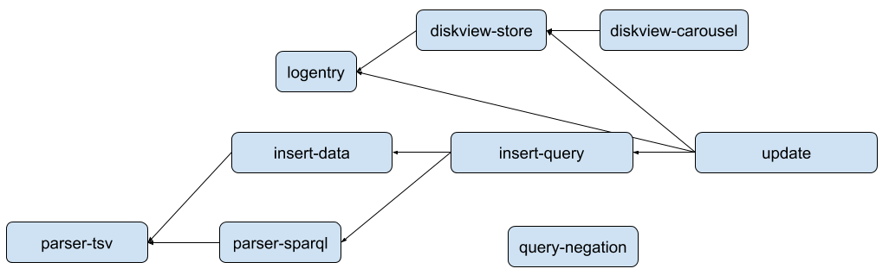

Update RFC (Insert and Delete)
==============================

*This RFC was written in February-March 2019. Only some of the insert features
have been implemented as of March 2019. Some sections were redacted and edited
before making this public.*

## Summary
This RFC proposes a new path for inserting and deleting facts in Akutan. With this
proposal, users will have a convenient way to manage the graph and maintain its
consistency, by leveraging Akutan's underlying support for transactions. This RFC
would bring Akutan close to implementing a subset of the
[Sparql 1.1 Update specification](https://www.w3.org/TR/sparql11-update/).

## Motivation

The previous insert capability was developed for ProtoAkutan and has
several limitations:

  - It does not handle automatic assignment of External IDs. Instead
    of writing `akutan:banana akutan:color akutan:yellow`, users must write:

        New Subject Vars: [?banana, ?color, ?yellow]
        Facts: [
        [s:?banana, p:<HasExternalID>, o:"akutan:banana"],
        [s:?color,  p:<HasExternalID>, o:"akutan:color"],
        [s:?yellow, p:<HasExternalID>, o:"akutan:yellow"],
        [s:?banana, p:?color, o:?yellow]]

  - It does not enforce uniqueness of external IDs. Users can accidentally
    create multiple entities with the external ID `akutan:banana` or `<banana>`.
  - The client must know if it's creating a new entity or referencing an
    existing entity. This leads to time-of-check time-of-use races with
    concurrent clients.
  - This one is an easily fixable problem, but nevertheless, the existing insert
    path assumes that a transaction succeeds after an append of a commit
    decision command succeeds. However, it's possible that the transaction timer
    appends an abort decision command before the commit, in which case the
    transaction aborts. The user receives the wrong outcome right now.
  - The current insert API takes a data structure as input. Most other software
    in the ecosystem inserts with a multi-line string in one of various formats.

The only current delete capability is `Wipe`, which deletes the entire graph.
This is unsuitable for a large production graph, where a fine-grained delete
operation is necessary to update small parts of the graph without affecting
other users.

This RFC proposes deprecating the current insert path and adding a new update
mechanism, with the following goals:

  - It will support atomic inserts, deletes, and combined insert and delete (to
    form atomic updates).
  - It will maintain system invariants, including those around external IDs.
  - It will allow the user to maintain consistency in their data, giving users
    the necessary primitives they need to avoid time-of-check time-of-use races.
  - It will allow the user to specify updates in at least one convenient format,
    with the ability to add more formats over time (like TSV, N-triples, Turtle,
    etc).

## Guide-level explanation

This RFC adds three new top-level Akutan API methods:

1. **Insert:** to ensure facts exist,
2. **Delete:** to ensure facts do not exist,
3. **Update:** to delete and insert atomically.

Where the format supports it, Update can also be used to insert without deleting
or delete without inserting. This doesn't work for formats like `tsv` that don't
say whether to insert or delete the facts they describe.

Note that it is not an error to insert facts that already exist (the facts will
not be duplicated). It is also not an error to delete facts that do not exist.

Update and Delete can only be used to remove static facts. Any attempt to remove
inferred facts will have no effect on the graph.

Each API method will execute the entire request atomically, and concurrent
requests will not observe intermediate results.

Each API method will take two arguments:

  - A format specifier, such as `tsv` or `sparql`.
  - A multi-line string in that format.

Each API method will return:

  - A status code from the following list:
      - OK
      - Parse error
      - Schema violation
      - Request too large to execute atomically
      - Unsupported (for requests that the current implementation cannot
        execute)
  - If successful (status is OK), a recent log index at which the requested
    outcome can be observed.
  - If not successful (status is not OK), a human-readable explanation.

This RFC defines the `tsv` format for Insert and Delete and the `sparql` format
for Insert, Delete, and Update. These are described in the following
subsections. Note that the concepts of blank nodes and variables are introduced
in the `tsv` format, so readers shouldn't skip it. It is the intent of this RFC
to describe a foundation for supporting additional formats in the future.

### The `tsv` format

The `tsv` format will be a useful way to specify fact data without much
packaging. Despite its name (suggestions are welcome), the `tsv` format will
allow more flexible whitespace than just tabs.

It will accept triples like this:

    akutan:banana   akutan:color akutan:yellow
    akutan:eggplant akutan:color akutan:purple

where the details of different literal types, units, and languages are outside
the scope of this RFC.

An Insert request with `tsv` data will ensure each fact exists exactly once in
the graph. A Delete request with `tsv` data will ensure each of the facts does
not exist in the graph. An Update request with `tsv` data is ambiguous (should
these be inserted or deleted) and will result in a parse error.

#### Internal and External IDs

Entities in Akutan's underlying fact storage are represented as 64-bit integer IDs
called KIDs. These will be mapped automatically when the first insert RPC first
mentions them. For example, inserting the fact `akutan:banana akutan:color akutan:yellow`
will map `akutan:banana` to a new KID if the mapping for `akutan:banana` does not
already exist, and the same for `akutan:color` and `akutan:yellow`.

The KIDs are still visible to end users in Akutan. This RFC proposes that they may
be used inserted and deleted with `tsv`-format updates like so:

    #50 akutan:color #52

Users will also continue to be able to insert mappings manually, like so:

    #50 <HasExternalID> "banana"
    <banana> <color> <yellow>

Or:

    <eggplant> <HasExternalID> "aubergine"
    <aubergine> <color> <purple>

Note: In the first example, the system will not confirm that KID 50 references
an existing entity.

The following restrictions apply:

  - A manually mapped external ID may not be referenced before the fact that
    sets the mapping.
  - Attempting to map two different entities onto the same external ID will
    result in a schema violation error.
  - Attempting to map an entity onto one of its existing external IDs will
    produce no effect.
  - As a simplification for the implementation, attempting to map additional
    external IDs to the built-in predicate named `HasExternalID` will result in
    a schema violation.
      - Note: we could expand this restriction to apply to any built-in
        (well-known) entity. I believe that is simply a policy choice, whereas
        restricting additional external IDs for `HasExternalID` specifically has
        a significant impact on the implementation.

#### Variables and metafacts

Variables may be used in the first column of a four-column line to capture fact
IDs. Then they may be used in subsequent facts in the subject or object
position.

This allows inserting metafacts:

    ?f akutan:banana  akutan:color   akutan:yellow
       ?f           akutan:source  akutan:duh
       akutan:bob     akutan:likes   ?f

If an `akutan:banana akutan:color akutan:yellow` fact already exists, this will
ensure the metafacts exist about that existing base fact. If the
`akutan:banana akutan:color akutan:yellow` fact does not already exist, this will
insert both the new base fact and the metafacts.

The same may be used to delete metafacts together with the base fact they
belong to. However, this has two limitations:

  - If a user deletes a base fact and only some of its metafacts, Akutan will
    allow its other metafacts to be orphaned. These orphaned metafacts can still
    be deleted later using the KID form of the fact ID.
  - The `tsv` format can not express a request to delete a metafact without also
    deleting its base fact. This can be expressed using the `DELETE template`
    operation in the `sparql` format, described below.

#### Blank nodes

In Insert requests, users may use blank nodes with the `_:abc` syntax to
indicate that they wish to create new entities but not assign them external IDs.
The name given to a blank node is local to the Insert request and is not stored.
For example:

```
_:b foaf:firstname "Bob"
_:b foaf:surname "Smith"
```

Every time this Insert request runs, it inserts two new facts.

Blank nodes are not allowed in Delete requests, as they cannot refer to existing
facts.

Blank nodes could pose a problem when used as fact IDs. For example, consider
the following insert request:

```
    akutan:banana akutan:color akutan:yellow
_:f akutan:banana akutan:color akutan:yellow
_:g akutan:banana akutan:color akutan:yellow
```

How many new facts should be inserted? As a consequence of this scenario, this
RFC proposes that any Insert, Delete, or Update request with a blank node as a
fact ID will result in a failure (parse error). See the discussion in "Rationale
and alternatives".

### The `sparql` format

The `sparql` format is more expressive than `tsv`, allowing more complex updates
and conditions. The Sparql 1.1 Update specification defines several operations,
described below.

In Sparql 1.1 Update, the operations can be joined together arbitrarily with
semicolons into a larger request, which logically executes in the order given.
Example 4 from Sparql 1.1 Update (§3.1.2) shows how to use a `DELETE DATA`
operation and an `INSERT DATA` operation in a single request:

    DELETE DATA { akutan:book123 dc:title "Compiler Desing" } ;
    INSERT DATA { akutan:book123 dc:title "Compiler Design" }

This RFC proposes a restricted from of requests, where the only requests that
allow multiple operations are of this `DELETE DATA` semicolon `INSERT DATA`
form. (This restriction is explained in the "Rationale and alternatives"
section). Specifically, this RFC proposes that:

  - An entire request will be atomic, combining all its operations into a single
    atomic unit.
  - The scopes of variables and blank nodes will be local to an operation, not
    shared across the request.
  - The Insert API method will accept only a single `INSERT DATA` or
    `INSERT template` operation.
  - The Delete API method will accept only a single `DELETE DATA` or
    `DELETE template` operation.
  - The Update API method will accept any of the following:
      - A single `INSERT DATA` operation,
      - A single `DELETE DATA` operation,
      - A single `DELETE DATA` operation followed by a semicolon and a single
        `INSERT DATA` operation,
      - A single `INSERT template` operation,
      - A single `DELETE template` operation, or
      - A single `DELETE template INSERT template` operation (this is one
        compound operation, without a semicolon).

Note: This section uses (nearly) standard Sparql syntax. However, the initial
implementation in Akutan will not be standards-compliant, as Akutan's current parser
is not yet standards compliant. The initial implementation will contain patterns
with syntax more like the `tsv` format, analogous to how Akutan queries today have
some Sparql syntax and some legacy syntax. Moreover, the Sparql syntax may be
extended somewhat to support metafacts. For the purpose of this RFC, readers
should focus on the shape of the requests, not the detailed syntax.

#### `INSERT DATA` and `DELETE DATA` operations

`INSERT DATA` operations have essentially the same capabilities as an Insert
request with the `tsv` format. As defined in Sparql 1.1 Update (§3.1.1),
`INSERT DATA` ensures each of the given facts exists in the graph. Here's a
simple example:

    INSERT DATA
    {
      akutan:book123 dc:title   "The Tale of Akutan" ;
                   dc:creator "Bob" .
    }

`DELETE DATA` operations have essentially the same capabilities as a Delete
request with the `tsv` format. As defined in Sparql 1.1 Update (§3.1.2),
`DELETE DATA` ensures each of the given facts does not exist in the graph.
Here's a simple example:

    DELETE DATA
    {
      akutan:book123 dc:title   "The Tale of Akutan" ;
                   dc:creator "Bob" .
    }

As in the Sparql 1.1 Update specification, blank nodes will be allowed in the
subject, predicate, and object fields in `INSERT DATA` operations. Blank nodes
will not be permitted in `DELETE DATA` operations.

The Sparql 1.1 Update specification restricts the data between the braces to
disallow variables. This RFC instead proposes adding an optional, non-standard
fact ID "column" to both `INSERT DATA` and `DELETE DATA` operations. This will
enable capturing a fact ID as a variable to use in subsequent metafacts. This
will behaves similarly as in Insert and Delete requests with the `tsv` format.

#### `INSERT tpl`, `DELETE tpl`, and `DELETE tpl INSERT tpl` operations

These three operations are described in Sparql 1.1 Update (§3.1.3). They are
similar to the `CONSTRUCT` form of Sparql queries. In the three operations, the
WHERE clause is evaluated as if part of the Sparql query `SELECT * WHERE ...`.

The `INSERT template` operation looks like this:

    INSERT { ?fruit akutan:color akutan:violet .
             akutan:bob akutan:dislikes ?fruit }
    WHERE  { ?fruit akutan:color akutan:purple }

The `DELETE template` operation looks like this:

    DELETE { ?person ?property ?value }
    WHERE { ?person ?property ?value ;
                    foaf:givenName "Bob" }

The combined `DELETE template INSERT template` operation looks like this:

    DELETE { ?person foaf:givenName 'Bill' }
    INSERT { ?person foaf:givenName 'William' }
    WHERE  { ?person foaf:givenName 'Bill' }

Note that this is a single combined operation, not two distinct operations
joined with a semicolon into the same request. The `WHERE` clause logically
executes first and is evaluated only once. Its results are used to expand
variables in both the `DELETE` template, and the deletes are performed. Then,
the same results are used to expand variables in the `INSERT` template, and the
inserts are performed.

The templates may contain triples with no variables. These will be deleted or
inserted only if the solution from the WHERE clause is not empty.

Variables will have different behavior depending on where they appear:

  - Variables in the `WHERE` clause query will create bindings.
  - Variables in the fact ID position of `INSERT` and `DELETE` templates will
    create new bindings that capture the fact ID, usable only in subsequent
    facts within that template. Attempting to bind a bound variable will result
    in a parser error.
  - Variables in the subject, predicate, and object positions of `INSERT` and
    `DELETE` templates will refer to existing bindings.

Note that the `DELETE template` operation can be used to delete a metafact
without deleting the base fact:

    DELETE {     ?f           akutan:source  akutan:duh }
    WHERE  { ?f  akutan:banana  akutan:color   akutan:yellow }

Blank nodes will have different behavior depending on where they appear:

  - Blank nodes in the `WHERE` clause query will be handled the same as in `SELECT`.
    Per the Sparql 1.1 Query specification, they are treated more-or-less as
    variables. Akutan today does not allow blank nodes in queries, and changing
    that behavior is outside the scope of this RFC.
  - Blank nodes will be prohibited in a `DELETE template` operation and in the
    `DELETE` section of a `DELETE template INSERT template` operation.
  - Blank nodes in the fact ID positions of any template will be disallowed.
  - Blank nodes in the subject, predicate, or object positions of an
    `INSERT template` operation and in the `INSERT` section of a
    `DELETE template INSERT template` operation will be instantiated separately
    for each solution (row) of the `WHERE` clause.

If nil values occur from optional matches, the insert or delete will continue,
skipping over affected facts. In the following example, the `akutan:email` facts
will remain unset for people that have no values for `foaf:mbox`:

    INSERT { ?person akutan:name  ?name .
             ?person akutan:email ?email }
    WHERE  { ?person foaf:name  ?name .
             OPTIONAL { ?person foaf:mbox ?email } }

The Sparql 1.1 Update spec may suggest (I'm not sure) that other unbound
variables be skipped over in a similar manner. This RFC proposes failing the
request with a parse error instead. Here's an example where `?foo` is unbound
because it does not appear in the `WHERE` clause, and this implies a client
error:

    INSERT { ?fruit akutan:taste ?foo }
    WHERE  { ?fruit akutan:color akutan:yellow }

The Sparql 1.1 Update spec suggests that primitive values bound to subject or
predicate fields be skipped over. This RFC proposes failing the request with a
schema violation instead. Here's an example, assuming `akutan:size` has a
numeric range:

    INSERT { ?size  rdfs:label "but numbers can't have labels" }
    WHERE  { ?fruit akutan:size  ?size }

### Application-level consistency

This section gives examples on how the requests defined above will allow users
to maintain consistency in their data.

This example (1) shows how to "update" an error in a base fact, but only if that
fact exists:

    DELETE { akutan:simon foaf:givenName 'Simone' }
    INSERT { akutan:simon foaf:givenName 'Simon' }
    WHERE  { akutan:simon foaf:givenName 'Simone' }

The previous example (1) will orphan any metafacts on the deleted fact. This
next example (2) would "port" some of them over:

    DELETE { akutan:simon foaf:givenName 'Simone' .
             ?fact ?p ?o }
    INSERT { akutan:simon foaf:givenName 'Simon' .
             ?fact ?p ?o }
    WHERE { ?fact akutan:simon foaf:givenName 'Simone' .
            OPTIONAL { ?fact ?p ?o } }

This example (2) still has two limitations:

  - It would not port metafacts over that have the base fact as their object. A
    pattern for such metafacts could be expressed in a similar way, but Akutan
    does not currently support lookup-by-object queries.
  - It also would not port over any meta-meta-facts. Each level of meta would
    require an additional optional match pattern.

This next example (3) shows how a user could maintain a uniqueness constraint on
social security numbers:

    INSERT { akutan:bob us:ssn "123456789" }
    WHERE  { ?unused <HasExternalID> "HasExternalID" .
             FILTER NOT EXISTS { ?x us:ssn "123456789" } }

Note that this WHERE clause query yields one result if SSN `123456789` is not
already in use and no results if SSN `123456789` is already in use. Therefore,
the example (3) assigns the SSN to Bob only if the SSN is not already assigned.
However, Akutan does not implement any form of negation in queries at this time.

## Reference-level explanation

This section first describes the changes to various components in Akutan,
then describes how to break up the changes into workable chunks.

### Components

#### Parser

The only change to the existing query parser will be to add support for blank
nodes. The legacy query parser will be used to parse the Insert and Delete facts
and templates.

Three new methods will be added to the parser: ParseInsert, ParseDelete, and
ParseUpdate, corresponding to the three new API methods. They will all produce
an AST like this:

```go
type Update struct {
  Query     WhereClause // may be empty
  QueryVars []*Variable // set of variables bound from Query
  Delete    []*Quad     // may be empty
  Insert    []*Quad     // may be empty
}
```

Requests in `tsv` format will fill `Delete` or `Insert` but not both.
Requests in `sparql` format may fill both. The `INSERT DATA`, `DELETE DATA`,
and `DELETE DATA ; INSERT DATA` requests will leave Query empty.
`INSERT template`, `DELETE template`, and `DELETE template INSERT template`
requests will fill Query.

The parser will check that:

  - Variables are bound and used correctly:
      - That no variable is bound twice (not in `QueryVars` and capturing a fact
        ID, and not capturing two fact IDs).
      - That no variable in the `Insert` and `Delete` fields is used before it
        is bound (a variable comes into scope on the line after the variable
        captures a fact ID).
      - That every variable that captures a fact ID in the `Insert` and `Delete`
        fields is used in a subsequent quad.
  - Blank nodes are bound and used correctly:
      - Blank nodes cannot appear in a fact ID anywhere.
      - Blank nodes cannot appear in the `Delete` field anywhere.
      - Blank nodes may be allowed in the subject, predicate, or object
        positions in the query (more-or-less as variables) and in the `Insert`
        field (as entities without external IDs).

The parser will not resolve external IDs for Insert, Delete, or Update requests.
The rewriter may be invoked separately, later, to resolve external IDs for the
`Query` field, as normal queries do.

#### Update module implementation

Updates will use the following algorithm:

1.  Get a recent log index (from a local cache or by asking a log server).
2.  Execute the reads of the query, external ID mappings, and existing facts at
    the index from (1).
3.  Build up a Start Update Transaction command based on the reads from (2). Do
    not include facts to be inserted that already exist, nor facts to be deleted
    that do not exist.
4.  If the update transaction contains no inserts and no deletes, return
    successfully with the index from (1).
5.  Append the command from (3) to the log. The index it is assigned is the
    "transaction index".
6.  Execute the same reads as in (2) but at the index just before the
    transaction index from (5).
7.  If the reads in (6) did not have the same results as the reads in (2):
    -  Append an Abort Decision command for the transaction started in (5).
    -  Go to (3), using the latest reads from (6) in place of the earlier reads
       from (2).
8.  Append a Commit Decision command for the transaction started in (5).
9.  If the Update request included an Insert, execute a LookupSPO of the first
    inserted fact as of the transaction index from (5). Otherwise, execute a
    LookupSPO of the first deleted fact as of the transaction index.
10. If the LookupSPO returns an empty result for an inserted fact or returns a
    non-empty result for a deleted fact, the transaction must have been aborted
    by some other process (the transaction timer) before the commit decision
    from (8) reached the log.
    -  Go to (3), using the latest reads from (6) in place of the earlier reads
       from (2).
11. Return with an OK status and the transaction index from (5).

Two possible optimizations are worth pointing out:

  - The second read in steps (6) and (7) can be skipped if the transaction index
    from (5) is exactly one greater than the index of the first reads from (2).
    This will be the case if the log saw no intervening writes (though
    optimizing for the idle case might be silly).
  - Step (9) can be started without waiting for step (8), since the LookupSPO
    won't return until the transaction has been resolved.

The Update module implementation will check that:

  - No external ID is used and then manually assigned.
  - Every manually assigned external ID is a non-empty string with no explicit
    language.
  - `<HasExternalID>` and its KID are not manually assigned any additional
    external IDs.
  - The update command is not too large to fit into a log entry and does not
    require too many KID offsets to cause an overflow.

#### Log commands

The current (legacy) insert commands are defined as follows:

```protobuf
message InsertTxCommand {
    repeated InsertFact facts = 1;
}

message InsertFact {
    // The resulting Fact will derive a FactID from this offset
    // and the log index that message was stored at.
    int32 factIDOffset = 1;
    KIDOrOffset subject = 2;
    KIDOrOffset predicate = 3;
    // Note that the ability to specify an KID offset in a
    // KGObject is part of KGObject itself rather than there
    // being a wrapper KGObjectOrOffset type.
    KGObject object = 4;
}
```

This RFC proposes deprecating `InsertTxCommand` and using a new command for
all updates:

```protobuf
message UpdateTxCommand {
  // The deletes logically execute before the inserts.
  repeated DeleteFact deletes = 1;
  // InsertFact is the same as before.
  repeated InsertFact inserts = 2;
}

message DeleteFact {
  // All these fields, including the factID, must be set.
  uint64 factID = 1;
  uint64 subject = 2;
  uint64 predicate = 3;
  // The writer MUST NOT use an offset anywhere in the object,
  // neither for 'object' itself nor for its unit or language.
  KGObject object = 4;
}
```

This RFC suggests placing an additional limit on the writer of
`UpdateTxCommand`, to limit the number of facts to delete and to insert. The
current KID offset bounds the number of inserted facts, but no such bound
applies to the deletes.

#### DiskView

The DiskView will need several updates to support deleting facts using
tombstones.

The first question is how to represent tombstones in the embedded key-value
store (RocksDB).

Should they be represented as a marker in the key or a marker in the value? This
is discussed in "Unresolved questions".

If tombstones are represented as values, the pending transactions tree will need
to be updated to store values.

The various lookup calls will need to remove deleted facts, as appropriate for
their log index. To minimize the chance of bugs, this should be implemented in
one place, such as the `newLatestIndexFilter`. That object can probably be
simplified on the basis that a fact can only be created, then deleted; it cannot
have multiple "versions" over its lifetime.

The fact statistics that are fed into the query planner should exclude deleted
facts.

The `CarouselResult` will need to include deleted facts, with a marker that
they've been deleted. CarouselResult is currently defined as:

```protobuf
message CarouselResult {
    repeated Fact facts = 1;
}
```

Unfortunately, the `Fact` message is widely used throughout the codebase in
places where tombstones aren't relevant. To avoid confusion, this RFC proposes
updating `CarouselResult` as follows:

```protobuf
message CarouselResult {
    repeated FactOrTombstone facts = 1;
}
message FactOrTombstone {
    // True for deleted facts, false otherwise.
    bool tombstone = 1;
    // For tombstones, the index of the fact is the transaction
    // index when the delete took place. The fact ID, subject,
    // predicate, and object are that of the original fact.
    Fact fact = 2;
}
```

### Implementation plan

This RFC proposes many changes, which could be broken down like this:

  - **parser-tsv:** Implement parser support for Insert and Delete with the
    `tsv` format. This is nearly complete in master for Insert, with the
    exception of blank nodes. Slightly different validation rules apply for
    Delete.
  - **parser-sparql:** Implement parser support for the `sparql` format (loosely
    speaking).
  - **insert-data:** Implement the Insert API for requests with no queries,
    using InsertTxCommand.
  - **insert-query:** Implement the Insert API for requests with queries.
  - **update:** Implement the Update and Delete API for deletes and
    delete-then-inserts with and without queries.
  - **logentry:** Migrate from `InsertTxCommand` to `UpdateTxCommand`.
  - **diskview-store:** Implement DiskView changes to store tombstones and
    filter them out for lookups.
  - **diskview-carousel:** Update the DiskView to return tombstones from the
    carousel and to exclude deleted facts from stats.
  - **query-negation:** Implement negation for queries, which is useful to allow
    users to enforce consistency properties like uniqueness constraints. This
    should probably be deferred and probably needs its own RFC.

It should be possible to parallelize much of the implementation. Here's a rough
dependency diagram:



## Drawbacks

First, deletes make reasoning about the data more difficult. The codebase may
have latent bugs that assume facts cannot be deleted (like caching an xid).
However, I think some form of fine-grained deletes are necessary.

Second, this RFC assumes that using transactions to maintain consistency
properties is desirable, yet in the Semantic Web environment, updates are
necessarily handled more loosely. We think the consistency properties proposed
in this RFC will be useful, but they may not be required.

Third, the Sparql 1.1 Update syntax may not be the best one:

  - Some simple invariants, like uniqueness constraints, are awkward to express.
  - Blank nodes may lead to undesirable duplication of facts.

Fourth, this RFC assumes the Akutan API server initiates transactions. An
alternative would be to allow clients to do long-running transactions, as in
SQL. Long-running transactions have the advantage of allowing clients to check
application-level conditions, but they have the significant disadvantage of
allowing clients to delay progress for each other. Long-running transactions
would require a different use of the log and different API-level requests.
However, support for Sparql 1.1 Update might still be good for simple updates,
even if long-running transactions were someday supported.

## Rationale and alternatives

One alternative in procedure would be to split this RFC into two parts: insert
and delete/update. This would appear advantageous, since this RFC is quite
large. However, insert and delete/update are probably too intertwined to
consider separately.

An alternative to deleting facts internally would be to use metafacts to write
deletions as normal facts. For example, one could delete:

    ?f akutan:banana akutan:color akutan:blue

by inserting:

       ?f akutan:status akutan:redacted

This would bring some new challenges:

  - Can you undelete a fact by redacting the redacted metafact?
  - Requiring users to check manually for redactions would be inconvenient.
  - Akutan currently does not store metafacts near facts, so automatically
    checking for redactions would cause substantial overhead for queries.

This RFC proposes three top-level API methods called Insert, Delete, and Update,
with formats called `tsv` and `sparql`. Alternatively, we could have one
high-level API method called Update with formats called `tsv-insert`,
`tsv-delete`, and `sparql`. This seems easy to change later if we find a
compelling reason to do so.

This RFC allows only `DELETE DATA ; INSERT DATA` compound requests. The
reason for this is that it would be quite difficult to make arbitrary compound
requests atomic with Akutan's current transaction mechanism. For example, if the
second operation in a compound request required executing a Sparql query, it
would need to somehow see the effects of the first operation. Yet, both
operations must fit into a single log command. As a result, this RFC restricts
the compound requests to something that seems both useful and reasonable to
implement.

One issue with metafacts is that to logically update the base fact, users have
to port over all of the metafacts (and meta-metafacts). Alternatively, we could
make it possible to update facts in place, keeping the same fact ID as before.
The more explicit semantics proposed in this RFC may be preferable, as the
metafacts may no longer apply to the new fact.

This RFC proposes disallowing blank nodes as fact IDs in Insert and Update
requests, and disallowing all blank nodes in describing facts to delete. Readers
may want to refer to the `tsv` format section for the rationale. There are two
reasonable alternatives:

1.  Treating blank nodes in the fact ID position similarly to variables would
    also be possible: they would capture (bind) the existing fact ID if the
    described fact exists, or they would capture the new fact ID otherwise. This
    way, the use of blank nodes would have fewer restrictions. However, the
    semantics of a blank node as a fact ID would differ from a blank node as a
    subject, predicate, or object.
2.  Another option is to allow blank nodes in the fact ID position, but fail the
    Update request with a schema violation error if a fact with the same
    subject, predicate, and object already exists.

The first alternative seems slightly more complex for users than disallowing
blank nodes there altogether. The second alternative seems likely to lead to
complex retry loops for clients, with no significant benefit. The proposed
approach would allow us to switch to one of these alternatives later, while
maintaining backwards compatibility.

## Prior art

Dgraph offers a nice way of specifying metafacts in Insert requests,
which they call
[facets or edge attributes](https://docs.dgraph.io/master/query-language/#facets-edge-attributes).
Here are some examples:

```
_:alice <car> "MA0123" (since=2006-02-02T13:01:09, first=true) .
_:person1 <name> "Daniel" (वंश="स्पेनी", ancestry="Español") .
```

Dgraph restricts edge attributes to be literal values.

Another possible syntax for metafacts is RDF*, in which the above example would
look like this:

```
_:alice <car> "MA0123" .
<<_:alice <car> "MA0123">> <since> "2006..."^^<xsd:dateTime> .
<<_:alice <car> "MA0123">> <first> "true"^^<xsd:boolean> .
```

RDF* allows metafacts as objects, as in the following example:

```
akutan:bob akutan:said <<_:alice <car> "MA0123">> .
```

The Dgraph and RDF* syntaxes may be nice to support in Akutan. Both can be
represented using internal variables in the proposed parser output (AST), so
permitting either or both formats would be a localized change for Akutan's parser
in the future.

Dgraph's restriction that metafacts can only have facts in the subject position
may be a useful one. In particular, it would allow efficient queries from a fact
ID to all of its metafacts, would allow metafacts to be stored with their base
fact, and would allow Akutan to delete metafacts when a base fact is deleted.
However, this restriction probably limits expressiveness too much. It's also
difficult to enforce in Akutan in isolation, since a user can come along and
insert a metafact as `<s> <p> #235`, where `#235` is a fact ID. Or,
similarly, a user can assign an external ID to a fact ID,then use that
external ID later. To enforce Dgraph's restriction, Akutan would need either:

  - To enforce the following restrictions first:
    -  Disallow the use of KIDs, so that all updates use external IDs.
    -  Disallow assigning external IDs to fact IDs.
  - Or, an efficient way to determine if a KID refers to a fact ID, by either:
    -  Allocating fact IDs from a different space, or
    -  Maintaining an index for this.

This is probably worth revisiting at a later date.

There's more to Sparql 1.1 Update than the subset described in this RFC.
Specifically, §3.1.3.3 describes a `DELETE WHERE { query }` shorthand. This RFC
excludes this request type because its semantics are not obvious with respect to
inference, and the benefit from keystrokes saved doesn't seem like it could
overcome the potential for error in misunderstanding the semantics.

## Unresolved questions

One concern is an Update request that you can express succinctly but which
causes many facts to be changed. For example:

    DELETE { ?person foaf:givenName 'Bill' }
    INSERT { ?person foaf:givenName 'William' }
    WHERE  { ?person foaf:givenName 'Bill' }

If the graph contains too many (about 500) people named Bill, the Update code
will be unable to write out a single log command with all the affected facts.
This would result in an Atomic Request Too Large error. As a result, the client
would need to run the query, and execute smaller delete+insert requests with
specific people in them. We hope that this is not an issue very often. Do we
need a nonatomic version of Update, and what would that look like?

The Disk Views could represent deleted facts in a few different ways. Suppose a
fact with ID 73 was created at index 1000 and deleted at index 2000. Here are
three reasonable options:

1.  `key="s:p:o:1000:73", value="D@2000"` (overwriting previous empty
    value)
2.  `key="s:p:o:2000:73:D", value=""` (empty value)
3.  `key="s:p:o:2000", value="ID:73;D"`

Option (1) requires issuing a read before the write to find index 1000, which
slows down the operation and adds a bit of complexity. Option (2) may be easier
to implement now, since we don't currently use values. Option (3) might make
encoding the keys easier by moving the fact ID to a ProtoBuf-encoded value. Are
there more compelling reasons to prefer one over another?

## Future possibilities

As mentioned above, supporting additional formats for update requests may be
useful. Also, Akutan should handle QNames, prefixes, IRIs, literals, units, and
languages better and more consistently for both queries and updates.

A Sparql protocol-compatible HTTP API for the update operations, as well as for
queries, would certainly be useful for interoperability. However, such
functionality seems out of scope for this RFC.

Akutan's current Wipe request is similar or equivalent to Sparql 1.1 Update's
`CLEAR DEFAULT` request. We may want to add support for that in the Update API
in the future, though it is dangerous to have readily available.

The Sparql 1.1 Update specification describes "Graph Management" of multiple
"RDF graphs" in a single "Graph Store". This seems out of scope for this RFC.
This RFC assumes all operations are done against the "unnamed graph" / "default
graph". Additional "named graphs" are an idea we may want to consider in the
future.

Someday, Akutan should probably purge deleted facts, rather than accumulating
them. This should be defined by some policy (like keep monthly snapshots). This
RFC also proposes a mechanism for automatically mapping external IDs to KIDs
when the external ID is first used, but there is no automated mechanism to
garbage collect external IDs when their KIDs are no longer needed.
